VQE算法简介
=================================

1.1 计算化学
----------------------------------

  随着量子化学理论的不断完善，计算化学已经成了化学工作者解释实验现象、预测实验结果、指导实验设计的重要工具，在药物的合成、催化剂的制备等方面有着广泛的应用。但是，面对计算化学所涉及的巨大计算量，经典计算机在计算精度、计算尺寸等方面显得能力有限，这就在一定程度上限制了计算化学的发展。而费曼曾提出：可以创造一个与已知物理系统条件相同的系统，让它以相同的规律演化，进而获得我们自己想要的信息。费曼的这一猜想提示我们——既然化学所研究的体系是量子体系，我们何不在量子计算机上对其进行模拟呢？

  就目前的有噪声的中等规模量子(NISQ)计算机而言，可以通过变分量子特征值求解算法(Variational Quantum Eigensolver，简称VQE)，在量子计算机上实现化学模拟。该算法作为用于寻找一个较大矩阵的特征值的量子与经典混合算法，不仅能保证量子态的相干性，其计算结果还能达到化学精度。

  计算化学，顾名思义，就是利用数学方法通过计算机程序对化学体系进行模拟计算，以解释或解决化学问题。早期由于计算能力较弱，化学研究主要以理论和实验交互为主。但随着科学技术的蓬勃发展、量子化学理论的不断完善，计算已经成为一种独立的科研手段，与理论和实验相为验证，密不可分。如今，计算化学对于化学工作者来说，已经成了解释实验现象、预测实验结果、指导实验设计的重要工具，在材料科学、纳米科学、生命科学等领域得到了广泛的应用。

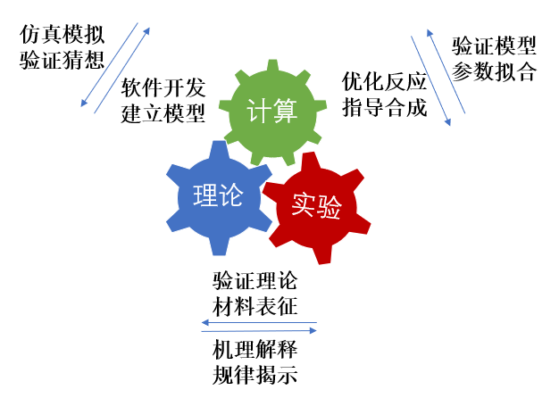
.. centered:: 图 1: 计算、理论与实验的相互关系

  计算化学主要包括两个分支——量子化学与分子模拟，其理论基础分别源自量子力学(Quantum Mechanics, QM)与分子力学(Molecular Mechanics, MM)。

  理论量子化学主要是使用量子力学(QM)来计算分子系统中电子的状态和性质。通俗意义上讲就是通过求解薛定谔方程来得到分子系统中电子的运动状态，而这些运动状态决定了其分子的化学性质。它们决定了一个化学反应是否能发生。精确求解电子Hamiltonian需要巨大的算力，对于小分子求解尚可进行，但是无法计算大分子。这时就需要基于经验参数的分子力场(Molecular Field)方法。

  在分子力场或分子力学(MM)方法中，分子被视为机械连接的原子系统。与量子力学方法不同的是，电子的具体分布没有被精确地计算，而是与原子核一起作为有效的原子(effective atoms)。由于分子力场的方法中，每个键的类型和参数都是在计算前根据体系被选定好的，它可以在典型的键合距离(bonding distance)下很好地描述大型的分子系统。但不可能描述发生键断裂和形成的反应或转化。换句话说，分子力场可以模拟大分子系统，但是无法精确求解其具体电子的分布，而这正是化学反应的关键所在。关于二者的对比介绍详见附录。

  这里我们主要聚焦量子化学方法。化学行为的本质是分子中电子运动的结果，而电子的运动遵循量子力学，所以量子化学是一个量子计算天然的用武之地。传统的量子化学主要使用经典计算机来计算模拟量子体系，但量子系统的波函数的复杂度随粒子数呈指数增长。这种指数级的增长使得经典计算机在处理类似问题时很棘手，比如当前人们对多体物理和强关联系统等问题还无法进行精确求解。基于量子力学原理的量子计算机给计算化学开辟了新的方向，由于量子比特的量子性质，可以实现叠加和纠缠，因此可以有效地存储量子系统的波函数。同时我们需要在计算化学中运用量子算法来加快运算效率，从而研究用经典算法有限甚至不可能计算的系统。

1.2 理论基础
----------------------------------

1.2.1 电子结构问题
^^^^^^^^^^^^^^^^^^^^^^^^^^^^^^^^^^
  在对一个 :math:`N` 电子体系计算模拟时，往往需要求解薛定谔方程，这就涉及到了 :math:`3N` 维波函数的求解。含时(time-dependent)薛定谔方程如式(1)所示 [1]_ ，其中 :math:`\hat{\mathrm{H}}` 是系统的Hamiltonian，它描述了整个系统的全部信息. :math:`\psi(x,t)\rangle` 是系统随时间变化的多体波函数。
当粒子处于与时间无关的势场中时,即势能只与粒子的位置 :math:`x` 有关。在经典力学中，若势能与时间无关，总能量就是一个运动常量；在量子力学中则存在着能量完全确定的态。薛定谔方程中粒子坐标 :math:`x` 和时间 :math:`t` 独立。分离变量后，我们可以得到不含时(time-independent)的薛定谔方程，即定态(stationary states) 薛定谔方程(物理上喜欢叫它能量本征方程，因此定态也叫能量本征态),如式(2)所示。这种形式的薛定谔方程是化学中最常见的也是最感兴趣的形式。

.. math::
    \hbar \frac{\partial}{\partial t}|\Psi(x,t)\rangle=\hat{H}|\Psi(x,t)\rangle \qquad (1)

.. math::
   \hat{H}|\psi(x)\rangle = E|\psi(x)\rangle \qquad (2)

  所以我们的核心目标可以描述为：求解在特定分子体系下不含时的、非相对论情况下的定态薛定谔方程，得到的解为体系处于不同定态下的本征值，即能量。根据变分原理(variational principle)可知，求得的最小特征值为体系的基态能量(ground-state energy), 对应的系统状态为基态(ground-state)。

  假设原子核和电子是质点并忽略自旋-轨道相互作用(spin-orbit interaction)，则对于一个多电子的分子体系而言，Hamiltonian可以写成式(3)的形式(原子单位)，式中 :math:`A,B` 指的是核，:math:`i,j` 指的是电子。其中第一项是电子的动能，第二项是核的动能，第三项表示电子与核的库仑吸引力，:math:`r_{Ai}` 是电子 :math:`i` 与原子序数为 :math:`Z_{A}` 的核 :math:`A` 之间的距离，第四项表示核与核的库仑排斥作用， :math:`R_{AB}` 是核 :math:`A` 与核 :math:`B` 之间的距离，最后一项表示电子与电子排斥作用， :math:`r_{ij}` 是电子 :math:`i` 与电子 :math:`j` 之间的距离。 

.. math::
    \hat{H}=-\frac{1}{2} \sum_{i} \nabla_{i}^{2}-\sum_{A} \frac{1}{2 M_{A}} \nabla_{A}^{2}-\sum_{A,i} \frac{Z_{A}}{r_{Ai}}+\sum_{A>B} \frac{Z_{A} Z_{B}}{R_{AB}}+\sum_{i>j} \frac{1}{r_{ij}} \qquad (3)

  在原子中往往核的质量比电子质量大得多，运动比电子慢。因此，可以忽略原子核的效应，假定电子运动在固定不动的原子核周围，这就是 Born-Oppenheimer近似。在这个近似下，式(3)中核的动能项可忽略不计，核间的排斥项可视为常数项，原子核和核外电子的运动就可以分开。系统的电子薛定谔方程可以写为式(4)，其中电子的Hamiltonian为式(5)的形式。

.. math::
   \hat{H}_{el}|\psi_{el}\rangle = E_{el}|\psi_{el}\rangle \qquad (4)

.. math::
   \hat{H}_{el}=-\frac{1}{2} \sum_{i} \nabla_{i}^{2}-\sum_{A,i}\frac{Z_{A}}{r_{A i}}+\sum_{i>j} \frac{1}{r_{ij}} \qquad (5)

1.2.2 二次量子化
^^^^^^^^^^^^^^^^^^^^^^^^^^^^^^^^^^
  前面的描述都是基于一次量子化，表达式比较复杂繁琐，下面我们引入简洁的二次量子化(second quantization)表示 [2]_ 。

  首先，我们定义 :math:`a_{i}^{\dagger}` 为产生算符(creation operator)，它的作用是在第i个自旋轨道上产生一个电子，同理，定义 :math:`a_{j}` 为湮灭算符(annihilation operator)，它的作用是在第j个自旋轨道上湮灭一个电子。电子是费米子(fermion)，其产生算符和湮灭算符遵循泡利不相容原理(Pauli exclusion principle)且服从反对易(anticommutation)关系,如式(6)所示。

.. math::
   \{a_{i},a_{j}\}&= \{a_{i}^{\dagger},a_{j}^{\dagger}\}=0 \\
	\{a_{i},a_{j}^{\dagger}\}&=a_{i}a_{j}^{\dagger} + a_{j}^{\dagger}a_{i} =\delta_{ij} \qquad (6)

.. math::
   \Phi_{HF}(\chi_1,\chi_2,\cdots,\chi_N)=|n_{M-1},n_{M-2},\cdots,n_0\rangle \qquad (7)

.. math::
   |n_{M-1},n_{M-2},\cdots,n_0\rangle = a_0^{\dagger} a_1^{\dagger} \cdots a_N^{\dagger}|\rangle = \prod_{i=1}^N a_i^{\dagger}|\rangle \qquad (8)

  在二次量子化的框架下，slater determinant可以表示成占据数态(occupation number state),这里采用轨道序数从右向左依次递增的约定,如式(7)所示。其中N为电子数，M为自旋轨道数。当自旋轨道 :math:`\chi_p` 被电子占据时， :math:`n_p` 为1时(此时该自旋轨道 :math:`\chi_p` 在 :math:`\Phi` 的表达式中)；反之，未被占据时， :math:`n_p` 为0(此时该自旋轨道不在 :math:`\Phi` 的表达式中)。换句话说，占据数态是一组只包含0和1的二元的数串，其长度是自旋轨道的数量，每一位上的1表示该编号下的自旋轨道是被占据的。
由此我们可以将一系列产生算符作用在真空态 :math:`|\rangle` 来构造任何系统的Hartree-Fock态。如式(8)所示。下面我们来举个例子理解一下这两个算符。

**例 1** 考虑有四个自旋轨道的氢分子体系。为了方便起见这里对自旋轨道进行编号，按照自旋轨道能量由低到高且将自旋向上(`alpha spin`)的电子序数排在自旋向下(`beta spin`)前面，其占据数态可表示为 :math:`|n_3 n_2 n_1 n_0\rangle` 。我们知道每个氢原子都有一个电子，所以一个氢分子体系有两个电子。根据分子轨道理论，这两个电子填充在能量较低的成键轨道上，如图2所示。该体系的 `Hartree-Fock` 态可构造为式(9)的形式。若此时，我们将算符 :math:`a_1` 作用在该态上，应用式(6)和真空态的性质，我们可以得到如式(10)的结果。

.. centered:: 图 2: 四个自旋轨道的氢分子体系

.. math::
   \Phi_{HF}(\chi_1,\chi_2) = a_{0}^{\dagger} a_{1}^{\dagger}|\rangle = |0011\rangle \qquad (9)
.. math::
   a_1|0011\rangle = a_1 a_0^{\dagger} a_1^{\dagger}|\rangle = -a_0^{\dagger} a_1 a_1^{\dagger}|\rangle =-a_0^{\dagger} (1-a_1^{\dagger} a_1)|\rangle = -a_0^{\dagger} |\rangle = -|0001\rangle \qquad (10)

  实际上，产生与湮灭算符作用在占据数态上可以表达成式(11)的形式，其中 :math:`(-1)^{\sum_{i=0}^{p-1} n_i}` 是相位因子，也称宇称(parity)。 :math:`\oplus` 表示模二加法( :math:`0\oplus1=1,1\oplus1=0` )。

.. math::
   &a_p\left|n_{M-1}, n_{M-2}, \ldots, n_0\right\rangle \\
	&=\delta_{n_p, 1}(-1)^{\sum_{i=0}^{p-1} n_i}\left|n_{M-1}, n_{M-2}, \ldots, n_p \oplus 1, \ldots, n_0\right\rangle \\
	&a_p^{\dagger}\left|n_{M-1}, n_{M-2}, \ldots, n_0\right\rangle \\
	&=\delta_{n_p, 0}(-1)^{\sum_{i=0}^{p-1} n_i}\left|n_{M-1}, n_{M-2}, \ldots, n_p \oplus 1, \ldots, n_0\right\rangle \qquad (11)

**例 2** 为了更好理解以上的公式，我们试着考虑图3的单电子激发态。可以看到对比图2处于基态的情况, 此时的激发态一个电子由轨道1激发到轨道3上，即从轨道1上湮灭，在轨道3上产生。用算符表示为 :math:`a_3^{\dagger}a_1|0011\rangle` 。首先来看 :math:`a_1` 作用在态 :math:`|0011\rangle` 上时，会将这个态变为负的 :math:`|0001\rangle` 。这是因为初始状态为 :math:`|0011\rangle` ，按 :math:`|n_3 n_2 n_1 n_0\rangle` 的编码顺序 :math:`n_1` 是1，那么 :math:`a_1` 去作用在1这个态上，会将其变为0，然后计算相位因子，发现相位因子等于1( :math:`n_0=1` ), 这样就产生一个负号。同理当 :math:`a_3^{\dagger}` 作用在态 :math:`|0001\rangle` 上时，其相位因子等于1( :math:`n_0+n_1+n_2=1+0+0=1` ),如下所示。

.. math::
   a_1|0011\rangle &= \delta_{1, 1}(-1)^{1}|0001\rangle = -|0001\rangle \\
	-a_3^{\dagger}|0001\rangle &= -\delta_{0, 0}(-1)^{1+0+0}|1001\rangle = |1001\rangle \qquad (12)

.. centered:: 图 3: 四个自旋轨道的氢分子体系的单电子激发态

  二次量子化后，电子的Hamiltonian表示成式(13)的形式 [3]_ ，该式中第一项为是单粒子算符，第二项为双粒子算符，下标 :math:`pqrs` 分别代表不同电子自旋轨道，其中 :math:`h_{pq}` 、 :math:`h_{pqrs}` 分别代表单、双电子积分，计算公式如式(14)所示。如果选定基组，我们就可以确定积分的具体值。

.. math::
   \hat{H}_{el}=\sum_{pq} h_{pq} a_{p}^{\dagger} a_{q}+\frac{1}{2} \sum_{pqrs} h_{pqrs} a_{p}^{\dagger} a_{q}^{\dagger} a_{s} a_{r} \qquad (13)
.. math::
   &h_{p q}=\int dr x_{p}(r)^{*}\left(-\frac{1}{2} \nabla^{2}-\sum_{A} \frac{Z_A}{\left|r_{A}-r\right|}\right) x_{q}(r) \\ 
   &h_{p q r s}=\int d r_{1} d r_{2} \frac{1}{\left|r_{1}-r_{2}\right|}  x_{p}\left(r_{1}\right)^{*} x_{q}\left(r_{2}\right)^{*} x_{r}\left(r_{1}\right) x_{s}\left(r_{2}\right) \qquad (14)

  从 :math:`h_{pq}` 的计算公式中，可以发现大括号中的两项正是一次量子化Hamiltonian中的电子动能项 :math:`-\frac{1}{2} \nabla^{2}` 和核与电子之间的引力势能项 :math:`-\sum_{A} \frac{Z_A}{\left|r_{A}-r\right|}` ;从 :math:`h_{pqrs}` 的计算公式中，可以发现 :math:`\frac{1}{\left|r_{1}-r_{2}\right|}` 正是一次量子化Hamiltonian中的电子间排斥能项。由此可见， :math:`h_{pq}` 和 :math:`h_{pqrs}` 起到了联系二次量子化Hamiltonian与一次量化Hamiltonian的作用。

  使用pyChemiq来构建费米子算符(fermionic operator)详见2.1节的代码介绍。

1.2.3 映射
^^^^^^^^^^^^^^^^^^^^^^^^^^^^^^^^^^
  由二次量子化我们得到了Hamiltonian的费米子形式，是不是就意味着可以直接输入进量子计算机中进行计算了呢？其实不然，因为量子计算机是以量子比特的语言运行的，这里的量子比特是一组可区分的粒子。而电子是费米子，它是以费米子算符的形式表示的全同粒子。因此，为了在量子计算机上模拟电子结构问题，我们需要一个映射关系，将电子的费米子算符映射(mapping)到量子计算机的泡利算符(pauli operator)。目前，比较常见的映射有Jordan-Wigner(JW)变换 [4]_ 、Bravyi-Kitaev(BK) [5]_ 变换和Parity变换 [6]_ 等。不同的变换所得到的量子线路深度可能有所不同，但他们的功能都是一致的，都是为了将费米子系统映射到量子计算机中去。随着研究的不断推进，在这些映射基础上，人们也发展了各式各样的新型映射，但应用较广的还主要是这些。接下来，我们以JW变换为例进行介绍。

  在JW变换中，每个分子自旋轨道的占据信息记录在量子比特的计算基(computational basis states) :math:`|0\rangle` 、 :math:`|1\rangle` 中，即 :math:`|0\rangle` 表示不占据， :math:`|1\rangle` 表示占据。因此，对于M个自旋轨道的系统，采用右边开始编码约定，存在如式(15)的映射关系。我们回顾一下费米子的产生算符和湮灭算符的作用，产生算符是将粒子从未占据态从 :math:`|0\rangle` 变为占据态 :math:`|1\rangle` ；湮灭算符将粒子从占据态 :math:`|1\rangle` 态变为未占据态 :math:`|0\rangle` 。为了在量子计算机中实现这种操作，我们需要进行人为的构建。我们可以发现，通过利用Pauli X矩阵和Pauli Y矩阵进行组合，可以在量子计算机上实现与费米子类似的操作，如式(16)所示。这里的 :math:`Q_j^{\dagger},Q_j` 是量子比特的产生与湮灭算符，:math:`X_j,Y_j` 表示Pauli X和Y矩阵作用在第j个量子比特上。

.. math::
   |n_{M-1},n_{M-2},\cdots,n_0\rangle \rightarrow{} |q_{M-1}\rangle \otimes |q_{M-2}\rangle \otimes \cdots \otimes |q_0\rangle \qquad q_j=n_j\in\{0,1\} \qquad (15)

.. math::
   Q_j=|0\rangle\langle1|=\frac{X_j+iY_j}{2} \qquad Q_j^{\dagger}=|1\rangle\langle0|=\frac{X_j-iY_j}{2} \qquad (16)

.. math::
   a_j &= I^{\otimes n-j-1} Q_j \otimes Z_{j-1} \otimes \cdots \otimes Z_0 \\
   a_j^{\dagger} &=I^{\otimes n-j-1} Q_j^{\dagger} \otimes Z_{j-1} \otimes \cdots \otimes Z_0      (17)

  有了 :math:`Q_j^{\dagger},Q_j` 对于模拟费米子来说还是不够的。费米子算符实现的除了产生、湮灭算符带来的占据态(occupation)信息的转变外，其相位因子(phase factor)还记录了体系的宇称信息。因此，要想在量子计算机上模拟费米子，还必须考虑记录体系的宇称信息的一个相位因子。对于JW变换，这个相位因子可以用一串Pauli-Z矩阵来等效替代。因此，在JW变换中，费米子的产生、湮灭算符可以表示为式(17)，其中n为自旋轨道数，也是量子比特数；j表示算符作用的子空间，即量子比特的序号。 :math:`Q_j^{\dagger},Q_j` 改变自旋轨道的占据态，一串Pauli-Z矩阵来实现相位因子。JW变换的主要思想是将费米子轨道的占据信息局域存储在量子比特中，但宇称信息非局域存储，因为式中每个Pauli -Z矩阵依次作用在不同的量子比特上。这也说明了对于JW变换，Pauli的权重随着自旋轨道数M的增加呈线性增长。

**例 3** 这里我们来具体举例说明在JW变换中费米子算符是如何转换成泡利算符的。以例2中提及的算符 :math:`a_3^{\dagger}` 和 :math:`a_1` 为例。(以下泡利算符之间都是直积形式，张量积符号已省略)

.. math::
   a_3^{\dagger} &= Q_3^{\dagger} Z_2 Z_1 Z_0 = \frac{1}{2}(X_3-iY_3)Z_2 Z_1 Z_0 = \frac{1}{2}X_3 Z_2 Z_1 Z_0-\frac{i}{2}Y_3 Z_2 Z_1 Z_0 \\
	a_1 &= I_3 I_2 Q_1 Z_0 = \frac{1}{2}I_3 I_2(X_1+iY_1) Z_0 = \frac{1}{2}I_3 I_2 X_1 Z_0 + \frac{i}{2}I_3 I_2 Y_1 Z_0      (18)

  这里，我们展示三个自旋轨道的JW变换示意图，如图4所示。可以看出，在JW变换下，每一个量子比特标识一个费米轨道，占据态和非占据态分别映射到量子比特的 :math:`|1\rangle` 态和 :math:`|0\rangle` 态。此时，轨道和量子比特是一一对应的。

.. image:: ./picture/JW.png
   :align: center
.. centered:: 图 4: 三个自旋轨道的JW变换示意图.图引自 [7]_ 

  为了让大家更好地理解JW变换，我们从数学上具体推导下对上面3比特的变换例子。我们假设基态的轨道占据情况是 :math:`|010\rangle` ，那么 :math:`a_2^{\dagger}` 作用在这个态上时，根据公式(11)，会将这个态变为负的 :math:`|110\rangle` 。对于 :math:`a_2^{\dagger}` 这个算符来说，经过JW变换，变为了一串 :math:`Q_2^{\dagger}Z_1 Z_0` 的直积形式，作用在初态 :math:`|010\rangle` 上，按照序号逐一作用上去发现， :math:`Z_0` 作用在0态上不产生效果， :math:`Z_1` 作用在态上产生一个负号， :math:`Q_2^{\dagger}` 作用在0态上，会将其变为1。因此我们发现，在JW变换下，系统前后是等价的，这也验证了JW变换的有效性——将费米子系统在量子计算机上等效地表示出来了。

.. math::
   &a_2^{\dagger}|010\rangle = \delta_{0, 0}(-1)^{0+1}|110\rangle = -|110\rangle \\
	&Q_2^{\dagger} \otimes Z_1 \otimes Z_0 |010\rangle = -|110\rangle \qquad (19)

1.2.4 拟设
^^^^^^^^^^^^^^^^^^^^^^^^^^^^^^^^^^
  为了获得与体系量子终态相近的试验波函数，我们需要一个合适的波函数假设，我们称之为拟设(Ansatze)。并且理论上，假设的试验态与理想波函数越接近，越有利于后面得到正确基态能量。实际上，在量子计算机上模拟分子体系基态问题，最终都是转换到在量子计算机上对态进行演化，制备出最接近真实基态的试验态波函数。经典的传统计算化学领域已经发展了多种多样的波函数构造方法，比如组态相互作用法(configuration interaction, CI), 耦合簇方法(coupled-cluster, CC)等。目前，应用在VQE上拟设主要分为两大类，一类化学启发拟设，如酉正耦合簇(unitary coupled-cluster, UCC)，另一类是基于量子计算机硬件特性构造的拟设，即Hardware-Efficient拟设。

**Hardware-Efficient拟设**

  Hardware-Efficient直接将 :math:`|00 \cdots 0 \rangle` 演化成纠缠态(可以看成是叠加态的特殊情形，其特征是不能分解成两个态的张量积)，不再经过Hartree-Fock态。第一篇提出VQE算法的文献用到的就是Hardware-Efficient拟设 [8]_ 。该拟设的量子线路的结构一般包括许多重复、密集的模块，每个模块由特定类型的含参数的量子门构成，这些量子门在目前含噪声的中型量子器件(NISQ)上更容易实现，因为其更能满足现有量子计算机的特点——较短的相干时间与受限的量子门结构。这一拟设被应用在小分子VQE的实验演示中 [9]_  [10]_，但是并不适用于更大的体系。因为它并不具体考虑模拟的实际化学体系，制备出了许多物理上不应存在的量子态，从而引入了巨大的参数量，使优化变得繁琐甚至无法进行 [11]_。以氢分子为例，它仅含两个电子，若使用最小基组，它的Hartree-Fock态可以写成 :math:`|0011\rangle` ，如例1所示。因此在不考虑自旋禁阻的情况下，只可能存在 :math:`C_{4}^{2}-1=5` 种激发态(包括单激发态和双激发态)。但是，在经过Hardware-Efficient拟设后，会产生 :math:`|0111\rangle` 甚至 :math:`|1111\rangle` 等电子数或总自旋量子数不守恒的激发态，这就增加了经典优化器需要优化的参数、提高了陷入“高原贫瘠”状态的可能性。

**酉耦合簇拟设**

  在求解体系基态能量时，若选用Hartree-Fock态作为初猜波函数，由于Hartree-Fock态为单电子组态，没有考虑电子关联能，所以要将其制备成多电子组态(也就是纠缠态)，以使测量结果达到化学精度。UCC中的CC即是量子化学中的耦合簇算符 :math:`e^{\hat{T}}`，它从Hartree-Fock分子轨道出发，通过指数形式的耦合算符得到真实体系的波函数,如式(20)所示。这里的 :math:`|\psi_{HF}\rangle` 即为HF波函数，是参考态。 :math:`\hat{T}` 即耦合簇理论中的电子簇算符，由子簇算符加和而成，其中 :math:`\hat{T}_1` 包含所有单激发的算符， :math:`\hat{T}_2` 包含所有双激发的算符，其余项以此类推。由于在一个多电子体系中，三激发、四激发发生的概率很小，所以通常在双激发处进行“截断”，最终只剩 :math:`\hat{T}_1` 和 :math:`\hat{T}_2` 两项，由产生算符与湮灭算符表示如式(21)所示。在例2中我们展示了氢分子单电子激发的一种情况，实际上在不考虑自旋禁阻与自旋对称的情况下，该体系的单双激发簇算符分别为式(22)所示。

.. math::
   &|\psi_{CC}\rangle = e^{\hat{T}} |\psi_{HF}\rangle \\
	&\hat{T} = \hat{T}_1 + \hat{T}_2 + \hat{T}_3 + \cdots \qquad (20)
.. math::
   &\hat{T}_1 = \sum_{r}^{vir} \sum_{a}^{occ}t_a^r a_r^{\dagger} a_a \\
	&\hat{T}_2 = \sum_{r,s}^{vir} \sum_{a,b}^{occ}t_{ab}^{rs} a_r^{\dagger}a_s^{\dagger} a_b a_a \qquad (21)
.. math::
   \hat{T}_1 = t_0^2 a_2^{\dagger} a_0 &+ t_0^3 a_3^{\dagger} a_0 + t_1^2 a_2^{\dagger} a_1 + t_1^3 a_3^{\dagger} a_1 \\
	&\hat{T}_2 = t_{01}^{23} a_3^{\dagger}a_2^{\dagger} a_0 a_1 \qquad (22)

  但是 :math:`e^{T}` 并不是酉算子，无法直接通过JW变换、BK变换等方法映射到量子比特上，所以需要构造出构造出酉算子版本的指数耦合簇算符，即酉耦合簇算符，如式(23)所示。

.. math::
   \hat{U} = e^{\hat{T}-\hat{T}^{\dagger}} \qquad (23)

.. math::
   \hat{U}(\theta) = e^{\hat{T}_1 (\theta)+\hat{T}_2 (\theta)-\hat{T}_1^{\dagger} (\theta)-\hat{T}_2^{\dagger} (\theta)}      (24)

  若UCC中的簇算符 :math:`\hat{T}` 只含 :math:`\hat{T}_1` 这一项，则称这一算符为单激发耦合簇(UCCS)算符；若UCC中的簇算符 :math:`\hat{T}` 含有 :math:`\hat{T}_1` 和 :math:`\hat{T}_2` 两项，则称这个算符为单双激发耦合簇(UCCSD)算符, 如式(24)所示。其中 :math:`\hat{T}_1(\theta)=\sum_{ij}\theta_{ij}a_i^{\dagger} a_j` ， :math:`\hat{T}_2(\theta)=\sum_{ijkl}\theta_{ijkl}a_i^{\dagger}a_j^{\dagger} a_k a_l` 。这里的 :math:`\theta_{ij}，\theta_{ijkl}` 就是需要通过优化器来优化的参数且均为实数，对应经典簇算符系数 :math:`t_a^r` 、 :math:`t_{ab}^{rs}` 与UCCS相比，UCCSD比UCCS多考虑了双电子激发态，因此演化线路就变得更为复杂，计算也更加耗时，但随之而来的计算精度也有所提升。得到费米子形式的簇算符后，怎样将其加载进量子线路上进行拟设线路的构造请参看1.2.5节与1.3.4节的内容。

  在含噪声的中型量子器件(NISQ)上，利用变分量子算法(如VQE算法)进行化学模拟，其模拟效果很大程度上取决于用于制备试验态的含参拟设线路的高效性。而拟设线路是否高效，一般可以通过线路含参个数、线路深度、双量子逻辑门的个数来判断。若线路含参个数过多，经典优化器在对线路参数进行优化时，容易陷入“高原贫瘠”状态；若线路过深(特别是双量子逻辑门过多)，演化时间就越长，所制备出的试验态的保真度就越低。所以设计拟设线路不仅要考虑到其结果的精度，其在线路上的效率也是在实际应用中要着重考虑的方面。针对拟设线路进行适当的截断或者优化也是目前许多学者的研究方向，比如ADAPT-VQE [12]_ ，根据各个算符的梯度自适应地选择构建拟设，大大减少优化参数和约化线路深度，做到同时节约计算资源并提高计算效率。VQE的其它改进方法还有很多，这里不再赘述，有兴趣的可查阅相关文献 [2]_ [13]_ [14]_。

1.2.5 Trotter分解
^^^^^^^^^^^^^^^^^^^^^^^^^^^^^^^^^^
  上节我们讲了酉耦合簇拟设，但在加载进量子线路上进行拟设线路的构造之前，还需要的一个关键技术就是Trotter分解 [15]_ (Lie-Trotter-Suzuki decomposition)，又称渐近近似定理。

  在模拟哈密顿量演化时，即 :math:`e^{-iHt}` 中对时不变(time-independent)的H，在大多数物理体系中，哈密顿量可写作许多局部相互作用的和的形式，即 :math:`H=\sum_{j=1} h_j` ，但由于其子项与子项之间在一般情况下是不对易的( :math:`[h_j,h_k]\neq 0` )，因此没有办法将其直接拆分。这就意味着在公式(25)中，等号左边与右边不相等。为了在量子计算机上实现哈密顿量的演化，需要使用Trotter分解，即考虑一阶近似下，如式(26)所示：

.. math::
   e^{-i H t}=e^{-i \sum_{j=1} h_j t}\neq \prod_{j=1} e^{-ih_jt}      (25)

.. math::
   e^{-i H t}=e^{-i \sum_{j=1} h_j t}=\left(\prod_{j=1} e^{-i h_j t / N}\right)^N+O\left(t^2 / N\right)      (26)

这里的 :math:`N=t/\Delta t` 是Trotter数，又称作切片数。当这个Trotter数趋于无穷时，此时步长 :math:`\Delta t` 就趋于零，也就是趋于没有分解，误差就消失了。但是这样所需的线路深度增加。因此，在实际的计算中，我们需要在精度和线路深度之间做一定的取舍。

  在式(24)中，指数项是由一系列簇算符构成，使用Trotter分解，即考虑一阶近似下， :math:`e^{\hat{A}+\hat{B}}\approx e^{\hat{A}} e^{\hat{B}}` ，则式(24)可以写为:

.. math::
   \hat{U}(\theta)=exp\left(\sum_{ij}\theta_{ij}(a_i^{\dagger} a_j - a_j^{\dagger} a_i)\right) \times exp\left(\sum_{ijkl}\theta_{ijkl}(a_i^{\dagger}a_j^{\dagger} a_k a_l- a_l^{\dagger}a_k^{\dagger} a_j a_i)\right)      (27)

再使用一次一阶近似下的Trotter分解，上式可以写为：

.. math::
   \hat{U}(\theta)=\prod_{ij}exp(\theta_{ij}(a_i^{\dagger} a_j - a_j^{\dagger} a_i)) \times  \prod_{ijkl}exp(\theta_{ijkl}(a_i^{\dagger}a_j^{\dagger} a_k a_l- a_l^{\dagger}a_k^{\dagger} a_j a_i))      (28)

在将各项费米子算符映射成泡利算符后，我们可以依次将泡利算符放到线路上进行拟设线路的构造。详见1.3.4节的内容。

1.3 VQE流程简介
----------------------------------

1.3.1 变分原理
^^^^^^^^^^^^^^^^^^^^^^^^^^^^^^^^^^
  对于一个 :math:`n` 阶的方阵，如果想找到它的特征值 :math:`\lambda_0,\lambda_1,\lambda_2,\ldots,\lambda_n` ，可以利用VQE算法。在量子化学中，该算法被用于寻找描述某一体系(如多电子体系)哈密顿量的特征值 :math:`E_0,E_1,E_2,\ldots,E_n` ，根据变分原理(Variational Principle)，其可求得的最小特征值即为体系的基态能量 :math:`E_0` 。这里的变分原理起源于数学领域的泛函分析，最初见于著名的例子最速曲线问题 [15]_，随后被物理和化学学者应用到各自领域中，意在解决无法直接解析的极值函数问题。变分原理的基础是Euler-Lagrangian方程，它对应着泛函的临界点。在量子化学中常用于解薛定谔方程以得到目标能量。变分法求解基态能量可表述如下 [1]_：

  设量子体系的哈密顿量为 :math:`\hat{H}` ， :math:`|\psi\rangle` 态为空间中任意未知的态矢量(称为试验态矢量),并且 :math:`|\psi\rangle` 满足归一化条件 :math:`\langle \psi|\psi \rangle =1`。我们将 :math:`\hat{H}` 在态 :math:`|\psi\rangle`中的平均值 :math:`\langle \hat{H} \rangle` 看作态矢量 :math:`|\psi\rangle` 的泛函。

.. math::
   \langle \hat{H} \rangle=\dfrac{\langle \psi |\hat{H}| \psi \rangle}{\langle \psi|\psi \rangle}     (29)

考虑一个任意的物理体系，其哈密顿量 :math:`\hat{H}` 与时间无关。设体系包括 :math:`\hat{H}` 在内的一组力学量完全集的共同本征态为 :math:`\{ |\psi_i \rangle \}` ，相对应的能量本征值为 :math:`E_0 \leq E_1 \leq E_2 \leq \ldots` ,展开试验态矢量 :math:`|\psi \rangle = \Sigma_i a_i |\psi_i \rangle` 。于是

.. math::
   \langle \psi |\hat{H}| \psi \rangle= \sum_{i=0}^{\infty} |a_i|^2 E_i     (30)

且有 :math:`\langle \psi|\psi \rangle = \sum_{i=0}^{\infty} |a_i|^2 = 1` 。 对于 :math:`i\geq 0` ，有 :math:`E_i \geq E_0` 且满足 :math:`|a_i|^2 E_i \geq |a_i|^2 E_0` ，因此

.. math::
   \langle \hat{H} \rangle=\dfrac{\langle \psi |\hat{H}| \psi \rangle}{\langle \psi|\psi \rangle} = \dfrac{\sum_i {|a_i|}^2 E_i}{\sum_i |a_i|^2} \geq \dfrac{\sum_i {|a_i|}^2 E_0}{\sum_i |a_i|^2}=E_0      (31)

上式说明，用变分原理求出的能量极值$\langle \hat{H} \rangle$总是大于或等于体系的准基态能量(exact ground state energy)，它给出了体系基态能量的一个上界(`upper bound`)。

  从式(31)中可以看出，如果所选择的试验态 :math:`|\psi\rangle` 正好就是体系的基态 :math:`|\psi_0\rangle` , 那么不等式中的等号成立，我们直接得到了体系的基态能量 :math:`E_0` ；但往往更多的情况是，选择的试验态 :math:`|\psi\rangle` 与体系的基态相比有一定差距，导致计算得到的 :math:`E` 大于 :math:`E_0` 很多，这时就需要引入一组参数 :math:`\vec{\theta}` ，通过不断迭代参数来调节试验态波函数 :math:`|\psi(\vec{\theta})\rangle` ，使其最终非常接近体系的基态。通过上述过程求解系统基态能量的方法称为变分法，也是VQE之所以是Variational的原因。

.. math::
   \langle \hat{H} \rangle=E(\vec{\theta})=\dfrac{\langle \psi(\vec{\theta}) |\hat{H}| \psi(\vec{\theta}) \rangle}{\langle \psi(\vec{\theta})|\psi(\vec{\theta}) \rangle} \geq E_0     (32)

1.3.2 VQE流程概述
^^^^^^^^^^^^^^^^^^^^^^^^^^^^^^^^^^
  变分量子特征值求解算法(Variational Quantum Eigensolver, VQE) 是一种经典-量子混合算法，它使用参数化的量子线路来构造波函数，利用经典计算机来优化这些参数，使哈密顿量的期望值最小化，得到的最小能量即所求的基态能量。它的基本流程如图5所示，具体流程包括量子态制备、哈密顿量子项 :math:`H_i` 的测量、求和、收敛性判断和参数优化等过程，其中，量子态制备(quantum state preparation)、哈密顿量子项的测量(也称量子期望估计 quantum expectation estimation)是在量子计算机上进行的，即图中淡黄色部分，其它的步骤如求和、参数优化由经典计算机完成，即图中淡蓝色的部分。

  具体来讲， VQE 算法流程可以总结为以下步骤： (i) 选一组随机初始参数 :math:`\theta_1^k, \theta_2^k, \theta_3^k \ldots \theta_n^k` ， (ii)在虚拟机或量子计算机上制备试验波函数 :math:`|\psi(\vec{\theta})\rangle` ， (iii) 对哈密顿量的各个子项进行测量，然后在经典计算机上进行求和，得 :math:`|\psi(\vec{\theta})\rangle` 的哈密顿量的期望值，即分子的能量， (iv) 判断该能量是否满足收敛条件，如果满足，则将该能量作为分子基态能量的近似值，终止计算；如果不满足，则变分优化参数，利用经典优化器产生一组新的参数 :math:`\theta_1^{k+1}, \theta_2^{k+1}, \theta_3^{k+1} \ldots \theta_n^{k+1}` ，重新制备量子态， (v) 重复(ii)-(iv)步，直到能量收敛。此时，理论上参数化量子线路已制备好哈密顿量的基态，或非常接近基态的状态。与量子相位估计算法相比， VQE需要更少的门数和更短的相干时间。它以多项式的重复次数换取所需的相干时间的减少。因此，它更适合于 NISQ 时代。

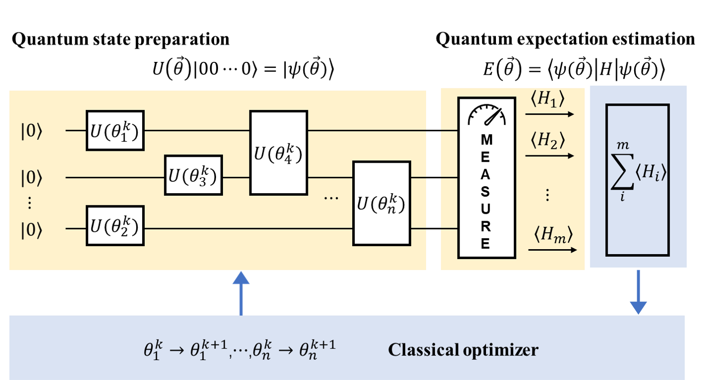
.. centered:: 图 5: 经典-量子混合的VQE算法流程(图改自 [16]_)

  图6展示的是VQE流程中量子线路的部分，即图5淡黄色的部分。量子态的制备部分我们以UCC拟设为例来进行线路构造。使用UCC拟设来制备试验态通常是先在线路上搭建好参照态 :math:`|\psi_{ref}\rangle` ，然后添加式(23)中的 :math:`\hat{U}` 酉耦合簇算符演化生成试验波函数 :math:`|\psi(\theta)\rangle` 。

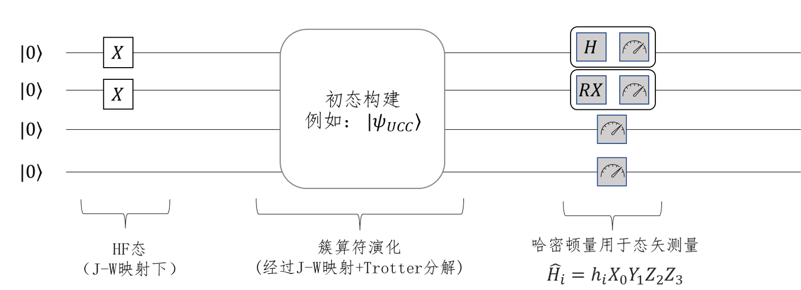
.. centered:: 图 6: VQE量子线路部分的流程

1.3.3 量子线路初态的构造
^^^^^^^^^^^^^^^^^^^^^^^^^^^^^^^^^^
  我们来看一下线路初态的具体构造。实际的演化线路中，开始每个比特的状态都默认为 :math:`|0\rangle` 态，若要构造 :math:`|1\rangle` 态的比特，我们首先需要对它翻转。回顾基础量子门的作用，Pauli-X门正好可以实现这个操作，所以只需对 :math:`|0\rangle` 态的对应比特施加X门即可，如式(33)所示。因此，JW映射下四个自旋轨道的氢分子体系的Hartree- Fock初态如图7所示，对第0、1比特施加X门就将 :math:`|0000\rangle` 的量子状态变成了所需的 :math:`|0011\rangle` 态。

.. math::
   \label{eq:Initial_state} X |0\rangle = \begin{bmatrix}0 & 1\\ 1 &  0 \end{bmatrix} \begin{bmatrix} 1\\ 0 \end{bmatrix} = \begin{bmatrix} 0\\ 1 \end{bmatrix} = |1\rangle     (33)

.. image:: ./picture/4_mo.png
   :align: center
.. centered:: 图 7: JW映射下四个自旋轨道的氢分子初态构建

  事实上，对于任意一个含有 :math:`M` 个自旋分子轨道的 :math:`N` 电子体系，它的 Hartree-Fock 态都可以这样简单的表示。只要在量子线路中给定 :math:`M` 个量子比特，然后在前 :math:`N` 个量子线路上加上Pauli-X门即可得到所需要的$N$电子体系的 Hartree-Fock态。  

.. math::
   |\psi_{HF}\rangle = |\underbrace{0 \ldots 0\overbrace{11\ldots11}^{\mbox{N个电子}}}_{\mbox{M个量子比特}}\rangle

.. image:: ./picture/m_mo.png
   :align: center
.. centered:: 图 8: JW映射下 `M` 个自旋轨道的 `N` 电子体系初态构建

1.3.4 拟设线路的构造
^^^^^^^^^^^^^^^^^^^^^^^^^^^^^^^^^^
  在理论基础章节讲完映射和拟设之后，原则上，只要我们给定费米子形式的簇算符，就可以将其转化成Pauli算符串，然后加载进量子线路上进行拟设线路的构造。接下来，我们看看如何根据这些Pauli算符串来得到最终的量子线路，然后进行演化。首先，考虑两个Pauli Z门的指数情况，在线路的情况如图9所示，这里的第一个CNOT门是用来纠缠两个量子比特，然后应用Rz门，再然后是第二个CNOT门。通过使用附加的CNOT门，这种线路结构可以推广到更多的量子比特。比如对于三个Pauli Z门的张量积情况，其线路如图10所示。所以可以看出，对于更多量子比特的情况，其线路结构也是很容易拓展得到的。

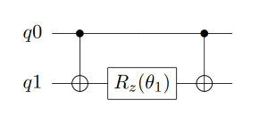
.. centered:: 图 9: 两个Pauli Z门的量子线路

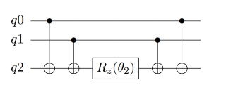
.. centered:: 图 10: 三个Pauli Z门的量子线路

  刚才，我们考虑的都是只有Pauli-Z门的。实际线路中，还存在许多含有其它Pauli算符的情况，这时我们就需要对X、Y基进行转换，转到Z基上再通过上述的线路实现。比如，对Pauli-X矩阵而言，可以通过在前后加一个H门来完成基的变换；而对于Pauli-Y门，则通过在前后加两个旋转X门来完成，如式(29)所示。因此，对于指数上含有Pauli-X门和Pauli-Z门的直积的情况，如 :math:`e^{-i \theta_3 (\sigma_x^0 \otimes \sigma_z^1)}` ，只需在Pauli-X门所作用的比特前后分别加H门就可以实现模拟，具体的量子线路如图11所示。类似的，当指数上有Pauli-Y门的时候，如 :math:`e^{-i \theta_4 (\sigma_z^0 \otimes \sigma_y^1)}` ，需要在其作用的量子比特前后各加一个旋转X门。具体的量子线路如图12所示。

.. math::
   \sigma_x &= H \sigma_z H \\
	\sigma_y &= {\rm RX}(-\dfrac{\pi}{2}) \sigma_z {\rm RX}(\dfrac{\pi}{2})     (34)

其中，

.. math::
   &{\rm RZ}(\theta)=e^{-i\theta Z/2}= \begin{bmatrix} e^{-i\theta/2} & 0\\ 0 & e^{i\theta/2} \end{bmatrix} \\
	H = \dfrac{1}{\sqrt{2}}&\begin{bmatrix} 1 & 1 \\ 1 & -1 \end{bmatrix} ; 
	{\rm RX}(\theta)= \begin{bmatrix} \cos(\dfrac{\theta}{2}) & -i\sin(\dfrac{\theta}{2}) \\ -i\sin(\dfrac{\theta}{2}) & \cos(\dfrac{\theta}{2}) \end{bmatrix}     (35)

  如果对于一些更加复杂的Pauli算符串，同时含有多个Pauli-X、Pauli-Y门时，利用这些规律进行扩展即可相应模拟线路。例如对于这个有4个Pauli算符串 :math:`e^{-i \theta_5 (\sigma_x^0 \otimes \sigma_z^1 \otimes \sigma_y^2 \otimes \sigma_x^3)}` ，其中包含了2个Pauli-X门、一个Pauli-Y门、一个Pauli-Z门，转换后得到它的量子线路如图13所示。

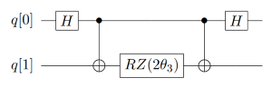
.. centered:: 图 11: 指数上含Pauli-X门的量子线路

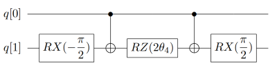
.. centered:: 图 12: 指数上含Pauli-Y门的量子线路

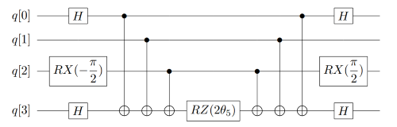
.. centered:: 图 13: 指数上更复杂的Pauli算符串的量子线路

  通过对上述过程进行推广，我们由此可以模拟复杂的酉正簇算符，让其在线路上对初态进行演化，从而制备出最接近真实基态的试验态波函数。下面我们就来看一下如何在量子线路上构造例2的单激发簇算符。在例3中我们已经通过JW变换将簇算符从费米子形式转换成泡利直积的形式，即：

.. math::
   a_3^{\dagger} &= \frac{1}{2}X_3 \otimes Z_2 \otimes Z_1 \otimes Z_0-\frac{i}{2}Y_3 \otimes Z_2 \otimes Z_1 \otimes Z_0 \\
	a_1 &= \frac{1}{2}I_3 \otimes I_2 \otimes X_1 \otimes Z_0 + \frac{i}{2}I_3 \otimes I_2 \otimes Y_1 \otimes Z_0     (36)

根据泡利算符的性质，则该单激发簇算符 :math:`a_3^{\dagger} a_1` 为四项：

.. math::
   \dfrac{i}{4} Y_1 \otimes Z_2 \otimes X_3 +\dfrac{1}{4} X_1 \otimes Z_2 \otimes X_3 +\dfrac{1}{4} Y_1 \otimes Z_2 \otimes Y_3 -\dfrac{i}{4} X_1 \otimes Z_2 \otimes Y_3     (37)

如我们在1.2.4节中所讲的，只有是厄米矩阵才可以放在指数上进行线路演化，我们需要构造出酉算子版本的指数耦合簇算符，如式(23)所示。这里 :math:`a_3^{\dagger} a_1` 要减去其共轭转置 :math:`a_1^{\dagger} a_3` ，即：

.. math::
   -\dfrac{i}{4} Y_1 \otimes Z_2 \otimes X_3 +\dfrac{1}{4} X_1 \otimes Z_2 \otimes X_3 +\dfrac{1}{4} Y_1 \otimes Z_2 \otimes Y_3 +\dfrac{i}{4} X_1 \otimes Z_2 \otimes Y_3     (38)

故最后留下两项，即

.. math::
   \dfrac{i}{2} (Y_1 \otimes Z_2 \otimes X_3 -X_1 \otimes Z_2 \otimes Y_3)     (39)

根据上述构造线路的方法，我们在量子线路上构造式(40) ，其量子线路如图14所示。

.. math::
   e^{\theta_{13}(a_3^{\dagger}a_1-a_1^{\dagger}a_3)}=e^{(i \theta_a/2) \sigma_y^1 \otimes \sigma_z^2 \otimes \sigma_x^3}e^{(-i \theta_b/2) \sigma_x^1 \otimes \sigma_z^2 \otimes \sigma_y^3}     (40)

  我们接着来看UCCSD整体拟设线路的构造。对四个自旋轨道的氢分子，不考虑自旋禁阻与自旋对称，它最终参数化的费米簇算符有五项，如式(22)所示，分别列于图15线路上五个模块中。图14的线路即是第二个模块的线路实现，描述的是位于轨道1的电子到轨道3上的激发。通过这五个模块的线路演化就获得了试验态。

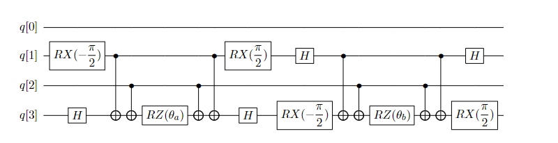
.. centered:: 图 14: 单激发算符 :math:`a_3^{\dagger} a_1-a_1^{\dagger} a_3` 的量子线路

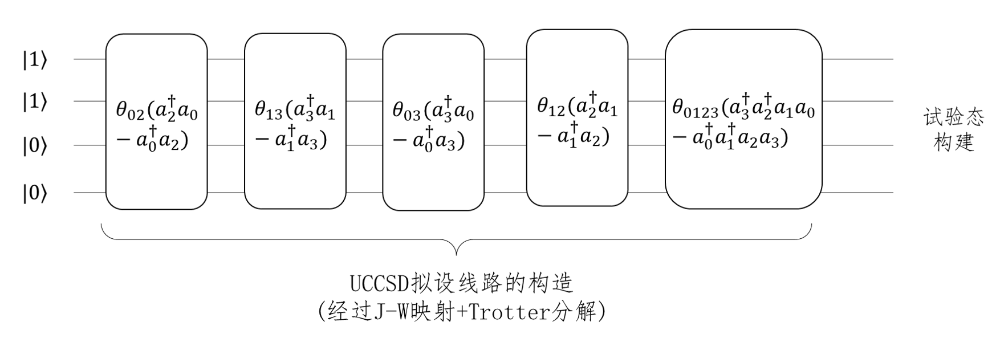
.. centered:: 图 15: JW映射下氢分子UCCSD拟设线路的构造

  图14展示的是一项单激发簇算符拟设线路的构造，双激发簇算符转换成泡利形式一共有16项，而且对于更大的基组，更多的电子数，单、双激发算符会更多，自然线路深度和待优化的参数量就会随之增长，正如我们在1.2.4一节最后一段提到的那样，针对拟设线路进行适当的截断或者优化对于模拟更大化学的化学体系具有重要的意义。

1.3.5 量子期望估计
^^^^^^^^^^^^^^^^^^^^^^^^^^^^^^^^^^
  拟设线路构造完成，制备好了试验态，我们就可以测量哈密顿量的期望，此过程又叫做量子期望估计。VQE中，哈密顿量作为可观测量用于测量过程。需要注意的是，经过映射后，尽管簇算符和哈密顿算符都会以泡利形式书写，但是哈密顿算符不需要经过指数化操作放在线路上演化，而是直接作用在最后的测量中，所以线路实现和前面所讲有些许不同。比如，对于一个哈密顿量 :math:`\hat{H}_i=h_i X_0 Y_1 Z_2 Z_3` ，它的测量线路如图16所示，其中类似秒表一样的符号是测量门操作。可以看到，第2，3比特上只有Z门，可以直接测量返还该态在计算基上的期望。但是第0，1号比特上存在X，Y门，这时需要分别使用H门和 :math:`RX(-\pi /2)` 门旋转换基到到Z方向再测得。

.. image:: ./picture/measure.png
   :align: center
.. centered:: 图 16: 哈密顿量用于态矢测量

接着我们来看测量值的读取。与QPE中使用二进制编码来存储相位信息不同，在VQE中，测量的结果是0、1构成的量子态，态的每一位比特存储的是自旋信息，这是由于“测量”代表使用Pauli-Z作用在末态上，此时量子位坍缩为 :math:`|0\rangle` 或 :math:`|1\rangle` 态。态 :math:`|1\rangle` 对应Pauli-Z中密度矩阵 :math:`|1\rangle\langle1|` 的系数是-1，态 :math:`|0\rangle` 对应密度矩阵 :math:`|0\rangle\langle0|` 的系数是1，所以，单次测量返还的结果如式(41)所示。真实结果通常要求反复多次测量，取若干次测量进行加权得到期望。假设进行m次测量，得到-1的次数为k，那么最终的期望 :math:`E_i` 可以按式(42)计算得到。

.. math::
   |j_1 j_2 \ldots j_n\rangle = (-1)^{\mbox{number of 1 in n}}     (41)

.. math::
   E_i = \langle H_i \rangle = h_i * \dfrac{-1*k + (m-k)}{m}     (42)

**例 4** 假设一哈密顿量 :math:`\hat{H}=h_0 XY + h_1 ZZ` ，其中系数 :math:`h_0, h_1` 为单、双电子积分常数，由经典计算积分而来，如式(14)中的 :math:`h_{pq}` 与 :math:`h_{pqrs}` ，表示每个子项的能量贡献值。在量子线路上，测量1000次的结果如下表所示。可以看到 :math:`h_0` 在 :math:`|00\rangle` ， :math:`|01\rangle` ， :math:`|10\rangle` ， :math:`|11\rangle` 四态出现的次数分别为200，200，100，500， :math:`h_1` 出现的次数分别为0，500，500，0。所以，根据式(42)计算，最终结果为 :math:`0.4h_0 - h_1` 。

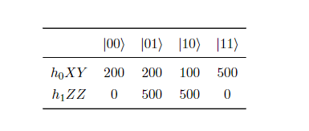

1.3.6 经典优化器参数优化
^^^^^^^^^^^^^^^^^^^^^^^^^^^^^^^^^^
  在1.3.1节中我们构造了含参的拟设线路，进行量子期望估计后，需要不断迭代优化Ansatze中涉及的参数以获取最低的能量，并以此能量最低的叠加态作为当前分子模型的基态。VQE中对这些参数的优化是利用经典优化器来处理的，截止目前，pyChemiQ提供了以下几种优化器：NELDER-MEAD、POWELL、COBYLA、L-BFGS-B、SLSQP和GRADIENT-DESCENT。其中无导数优化方法为Nelder-Mead, Powell, COBYLA; 一阶方法为L-BFGS-B、SLSQP和GRADIENT-DESCENT。

**NELDER-MEAD算法**

  NELDER-Mead方法是无导数优化方法，它可以用来解决求给定非线性方程最小值的经典无约束优化问题。对于具有n个参数的函数，该算法保留一个 :math:`n+1` 个点的集合，而这些点就是 :math:`n` 维空间中多面体的顶点。这个方法通常被称为“单纯形算法”。

**POWELL算法**

  POWELL又称方向加速法，它由POWELL于1964年提出，是利用共轭方向可以加快收敛速度的性质形成的一种搜索方法。该方法不需要对目标函数进行求导，当目标函数的导数不连续的时候也能应用，因此POWELL算法是一种十分有效的直接搜索法。POWELL算法可用于求解一般无约束优化问题，对于维数 :math:`n<20` 的目标函数求优化问题，此法可获得较满意的结果。不同于其他的直接法，POWELL法有一套完整的理论体系，故其计算效率高于其他直接法。该方法使用一维搜索，而不是跳跃的探测步。同时，POWELL法的搜索方向不一定为下降方向。

**COBYLA算法**

  线性近似的约束优化算法，简称COBYLA算法。该算法是一个顺序信赖域法。根据单纯形方法，问题的约束条件被转换为包含解的闭包单纯形。根据目前迭代最优解一定出现在闭包顶点上的理论，不断运用信赖域方法来优化和缩小可行性区域的闭包，最终求得满足精度要求的闭包和相应解。COBYLA算法是一个不需求导支持和线性约束的优化算法。

**L-BFGS-B算法**

  Limited-memory-BFGS-Bounded算法，简称L-BFGS-B算法，是一种拟牛顿算法。根据梯度方法的思路，可以得到牛顿法（二阶梯度法），然后使用正定矩阵来近似二阶导数矩阵以减少得到拟牛顿法所需的计算次数。通过继续简化正定矩阵的构建过程，构建近似矩阵的复杂度也得到降低，最终通过适应边界条件以获取该算法。L-BFGS-B算法是一个需要求导的有界无约束优化算法。

**SLSQP算法**

  Sequential Least SQuares Programming optimization，简称SLSQP算法。该算法是一个依赖KKT条件的顺序最小二乘规划算法。从本质上来讲，它是一个用来求解二次规划问题的顺序(或逐步)的拟牛顿法。SLSQP算法是一个需要使用求导方法的有界约束优化算法。它将一般的优化问题转化为二次规划问题。

**GRADIENT-DESCENT算法**

  梯度下降(gradient descent)是一种常见的一阶(first-order)优化方法，是求解无约束优化问题最简单、最经典的方法之一。梯度下降法的优化思想是用当前位置负梯度方向作为搜索方向，因为该方向为当前位置的最快下降方向，所以也被称为是“最速下降法”。最速下降法越接近目标值，步长越小，前进越慢。

**参考文献**

.. [1] Ira N. Levine. `Quantum chemistry` . Pearson Prentice Hall, Upper Saddle River, NJ, 5th edition, 2000.
.. [2] Sam McArdle, Suguru Endo, Alán Aspuru-Guzik, Simon C Benjamin, and Xiao Yuan. Quantum computational chemistry. `Reviews of Modern Physics` , 92(1):015003, 2020.
.. [3] Attila Szabo and Neil S Ostlund. `Modern quantum chemistry: introduction to advanced electronic structure theory` .Courier Corporation, 2012.
.. [4] E Wigner and Pascual Jordan. Über das paulische äquivalenzverbot. `Z. Phys`, 47:631, 1928
.. [5] Sergey B Bravyi and Alexei Yu Kitaev. Fermionic quantum computation. `Annals of Physics` ,298(1):210–226, 2002
.. [6] Jacob T Seeley, Martin J Richard, and Peter J Love. The bravyi-kitaev transformation for quantum computation of electronic structure. `The Journal of chemical physics` ,137(22):224109, 2012.
.. [7] Bela Bauer, Sergey Bravyi, Mario Motta, and Garnet Kin-Lic Chan. Quantum algorithms for quantum chemistry and quantum materials science. `Chemical Reviews` , 120(22):12685–12717, 2020.
.. [8] Alberto Peruzzo, Jarrod McClean, Peter Shadbolt, Man-Hong Yung, Xiao-Qi Zhou, Peter J Love, Alán Aspuru-Guzik, and Jeremy L Oąŕbrien. A variational eigenvalue solver on a photonic quantum processor. `Nature communications` , 5(1):1–7, 2014.
.. [9] Abhinav Kandala, Antonio Mezzacapo, Kristan Temme, Maika Takita, Markus Brink, Jerry M Chow, and Jay M Gambetta. Hardware-efficient variational quantum eigensolver for small molecules and quantum magnets. `Nature` , 549(7671):242–246, 2017. 
.. [10] Abhinav Kandala, Kristan Temme, Antonio D Córcoles, Antonio Mezzacapo, Jerry M Chow, and Jay M Gambetta. Error mitigation extends the computational reach of a noisy quantum processor. `Nature` , 567(7749):491–495, 2019.
.. [11] Jarrod R McClean, Sergio Boixo, Vadim N Smelyanskiy, Ryan Babbush, and Hartmut Neven. Barren plateaus in quantum neural network training landscapes. `Nature communications` , 9(1):1–6, 2018.
.. [12] Harper R Grimsley, Sophia E Economou, Edwin Barnes, and Nicholas J Mayhall. Adaptvqe: An exact variational algorithm for fermionic simulations on a quantum computer. `arXiv preprint arXiv:1812.11173` , 2018.
.. [13] Dmitry A Fedorov, Bo Peng, Niranjan Govind, and Yuri Alexeev. Vqe method: A short survey and recent developments. `Materials Theory` , 6(1):1–21, 2022.
.. [14] Yudong Cao, Jonathan Romero, Jonathan P Olson, Matthias Degroote, Peter D Johnson, Mária Kieferová, Ian D Kivlichan, Tim Menke, Borja Peropadre, Nicolas PD Sawaya, et al. Quantum chemistry in the age of quantum computing.  `Chemical reviews` , 119(19):10856–10915, 2019.
.. [15] Herman Erlichson. Johann bernoulli’s brachistochrone solution using fermat’s principle of least time. `European journal of physics` , 20(5):299, 1999.
.. [16]  Qingchun Wang, Huan-Yu Liu, Qing-Song Li, Ye Li, Yahui Chai, Qiankun Gong, Haotian Wang, Yu-Chun Wu, Yong-Jian Han, Guang-Can Guo, et al. Chemiq: A chemistry simulator for quantum computer. `arXiv preprint arXiv:2106.10162` , 2021.

