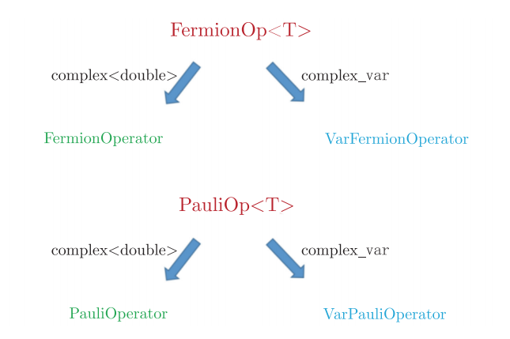

pyChemiQ接口介绍
=================================

2.1 费米子算符类与泡利算符类
----------------------------------

2.1.1 费米子算符类
^^^^^^^^^^^^^^^^^^^^^^^^^^^^^^^^^^
  我们在1.2.2节已经介绍过费米子的产生算符 :math:`a^{\dagger}_p` 和湮灭算符 :math:`a_q` 。在pyChemiQ中，我们用 :math:`P+` 表示产生算符 :math:`a^\dagger_p` ，用 :math:`Q` 表示湮灭算符 :math:`a_q` 。例如"1+ 3 5+ 1"代表 :math:`a^\dagger_1 a_3 a^\dagger_5 a_1` 。FermionOperator类也可以同时存储这一项的系数，例如构建费米子项 :math:`2a_0a^\dagger_1` 、  :math:`3a^\dagger_2a_3` 和 :math:`a^\dagger_1 a_3 a^\dagger_5 a_1` ：   

.. code-block::

   from pychemiq import FermionOperator
   a = FermionOperator("0 1+", 2)  
   b = FermionOperator("2+ 3", 3)
   c = FermionOperator("1+ 3 5+ 1",1)

  若要构建多个费米子项的加减，则采用字典序的形式构建多个表达式。例如p0构建 :math:`2a_0a^\dagger_1+3a^\dagger_2a_3` 。除此之外，我们还可以构造一个空的费米子算符类p1，里面不包含任何产生和湮没算符及常数项；或者只构造电子之间排斥能常数项，例如p2；也可以通过已经构造好的费米子算符来构造它的一份副本，例如p3。

.. code-block::

   p0 = FermionOperator({"0 1+": 2, "2+ 3": 3})
   p1 = FermionOperator()
   p2 = FermionOperator(2)
   p3 = p2

  FermionOperator类也提供了费米子算符之间加、减和乘的基础的运算操作。计算返回的结果还是一个费米子算符类。该类同样也支持打印功能，可以直接将费米子算符类打印输出到屏幕上。

.. code-block::

   plus = a + b
   minus = a - b
   multiply = a * b
   print("a + b = {}".format(plus))
   print("a - b = {}".format(minus))
   print("a * b = {}".format(multiply))

  通过使用上述示例代码， :math:`a+b` ， :math:`a-b` 和 :math:`a*b` 的计算结果如下：

.. code-block::

   a + b = {
   0 1+ : 2.000000
   2+ 3 : 3.000000
   }
   a - b = {
   0 1+ : 2.000000
   2+ 3  : -3.000000
   }
   a * b = {
   0 1+ 2+ 3 : 6.000000
   }

  还可以通过normal\_ordered接口对费米子算符进行整理。在这个转换中规定所作用的轨道编码从高到低进行排序，并且产生算符出现在湮没算符之前。整理规则如下：对于两个相同数字，交换湮没和产生算符，等价于单位1减去正规序。如果同时存在两个相同的产生或湮没算符，则该项表达式等于0(泡利不相容原理)；对于不同的数字，整理成正规序，需要将正规序的系数变为相反数(费米子算符的反对易关系)。例如表达式 “0 1+ 2+ 3”，整理成正规序 “2+ 1+ 3 0”，相当于不同数字交换了4次，系数不变。

.. code-block::

   print(multiply.normal_ordered())
   {
   2+ 1+ 3 0 : 6.000000
   }

  此外，费米子算符类还提供了data接口，可以返回费米子算符内部为维护的数据。

.. code-block::

   print("data = {}".format(a.data()))
   data = [(([(0, False), (1, True)], '0 1+'), (2+0j))]

2.1.2 泡利算符类
^^^^^^^^^^^^^^^^^^^^^^^^^^^^^^^^^^
  泡利算符是一组三个 :math:`2×2` 的酉正厄密复矩阵，又称酉矩阵。我们一般都以希腊字母 :math:`\sigma` 来表示，记作 :math:`\sigma_x` ， :math:`\sigma_y` ， :math:`\sigma_z` 。在量子线路中我们称它们为X门，Y门，Z门。 它们对应的矩阵形式如下所示：

  Pauli-X门：

.. math::
   X=\sigma_x=\begin{bmatrix} 0 & 1\\ 1 & 0 \end{bmatrix}
   
  Pauli-Y门：

.. math::
   Y=\sigma_y=\begin{bmatrix} 0 & -i\\ i & 0 \end{bmatrix}

  Pauli-Z门：

.. math::
   Z=\sigma_z=\begin{bmatrix} 1 & 0\\ 0 & -1 \end{bmatrix}

  以上三个泡利(Pauli matrices)有时也被称作自旋矩阵(spin matrices)。可观察到Pauli-X门相当于NOT门，其将 :math:`|0\rangle\rightarrow|1\rangle,|1\rangle\rightarrow|0\rangle` 。Pauli-Y门的作用相当于绕布洛赫球的 :math:`Y` 轴旋转角度 :math:`\pi` 。Pauli-Z门的作用相当于绕布洛赫球的 :math:`Z` 轴旋转角度 :math:`\pi` 。

**泡利算符具有如下性质：**

  1. 泡利算符与自身相乘得到是单位矩阵

.. math::
    &\sigma_x \sigma_x=I \\
		&\sigma_y \sigma_y=I \\
		&\sigma_z \sigma_z=I

  2. 顺序相乘的两个泡利算符跟未参与计算的泡利算符是 :math:`i` 倍的关系

.. math::
   &\sigma_x \sigma_y=i \sigma_z \\
    	&\sigma_y \sigma_z=i \sigma_x \\
    	&\sigma_z \sigma_x=i \sigma_y 

  3. 逆序相乘的两个泡利算符跟未参与计算的泡利算符是 :math:`$-i` 倍的关系

.. math::
   &\sigma_y \sigma_x=-i \sigma_z \\
			&\sigma_z \sigma_y=-i \sigma_x \\
			&\sigma_x \sigma_z=-i \sigma_y 

  pyChemiQ 中实现了泡利算符类 PauliOperator。我们可以很容易的构造泡利算符类，例如构造一个空的泡利算符项，如p1；或者构造带系数的泡利算符直积项 :math:`2\sigma_z^0\sigma_z^1` , 如p2。这里泡利算符右上角的数字代表作用在具体的量子比特，这一项代表的意义的是一个Pauli-Z门作用在量子比特0张乘一个Pauli-Z门作用在量子比特1上，该项的系数为2；若要构建多个泡利算符直积项的加和，可以采用字典序的形式，如p3构建的是 :math:`2\sigma_z^0\sigma_z^1 + 3\sigma_x^1\sigma_y^2` ；或者构造一个如p4的单位矩阵，其系数为5，也可以用如p5的形式来构建，二者等价。

.. code-block::

   from pychemiq import PauliOperator
   p1 = PauliOperator()
   p2 = PauliOperator("Z0 Z1", 2)
   p3 = PauliOperator({"Z0 Z1": 2, "X1 Y2": 3})
   p4 = PauliOperator(5)
   p5 = PauliOperator("", 5)

**注:**  *构造泡利算符类的时候，字符串里面包含的字符只能是空格、X、Y和Z中的一个或多个，包含其它字符将会抛出异常。另外，同一个字符串里面同一泡利算符的比特索引不能相同，例如：PauliOperator("Z0 Z0", 2)将会抛出异常* 。

  同费米子算符类一样，泡利算符类之间可以做加、减、乘等操作，计算返回结果还是一个泡利算符类。而且也支持打印功能，我们可以将泡利算符类打印输出到屏幕上，方便查看其值。

.. code-block::

   a = PauliOperator("Z0 Z1", 4)
   b = PauliOperator("X5 Y6", 3)
   plus = a + b
   minus = a - b
   muliply = a * b
   print(a)

  在实际使用的时候，我们常常需要知道该泡利算符项操作了多少个量子比特，这时候我们通过调用泡利算符类的接口getMaxIndex()得到。 如果是空的泡利算符项调用getMaxIndex接口则返回0，否则返回其最大索引值加1的结果。在下面的例子里，前者输出的值为2，后者输出的值为7。

.. code-block::

   a = PauliOperator("Z0 Z1", 2)
   b = PauliOperator("X5 Y6", 3)
   print(a.getMaxIndex())
   print(b.getMaxIndex())

2.1.3 可变费米子算符与可变泡利算符类
^^^^^^^^^^^^^^^^^^^^^^^^^^^^^^^^^^^^^
  费米算符类是一个模板类，如果用complex来构造该模板参数，得到的就是费米子算符类；如果用complex\_var类来构造模板参数，得到的就是可变费米子算符类；同样泡利算符类也是一个模板类，选择不同的模板参数类型，可以得到泡利算符类和可变泡利算符类，如图8所示。

.. centered:: 图 8: 可变费米子算符和可变泡利算符的构造

  可变费米子算符类和可变泡利算符类，跟费米子算符类和泡利算符类拥有相同的接口，但是在构造它们的时候所传的参数是个Var变量，在表达式不变的情况下，通过改变Var的值，即可改变表达式的值。示例代码如下：

.. code-block::

   from pychemiq import var
   from pychemiq import (VarFermionOperator,VarPauliOperator)
   x = var(2, True)
   y = var(3, True) 
   a = VarFermionOperator("0 1+",x)
   b = VarPauliOperator("Y0 Z1",y)

2.2 Molecules模块
----------------------------------
  在 pychemiq.Molecules这个模块中，我们可以初始化分子的电子结构参数, 包括分子的几何构型、基组、电荷、自旋多重度，将分子信息存储在对象中。输入参数后执行经典hartree-fock计算。下面我们以氢分子的电子结构为例进行演示。

.. code-block::

   from pychemiq import Molecules
   multiplicity = 1
   charge = 0
   basis =  "sto-3g"
   geom = "H 0 0 0,H 0 0 0.74"
   mol = Molecules(
	geometry = geom,
	basis    = basis,
	multiplicity = multiplicity,
	charge = charge)

  通过调用方法molecular\_hamiltonian()可以得到费米子形式的分子Hamiltonian子项及每项的系数。以下是示例代码及氢分子的费米子Hamiltonian打印结果。

.. code-block::

   fermion_H2 = mol.get_molecular_hamiltonian()
   print(fermion_H2)

   {
   : 0.715104
   0+ 0 : -1.253310
   1+ 0+ 1 0 : -0.674756
   1+ 0+ 3 2 : -0.181210
   1+ 1 : -1.253310
   2+ 0+ 2 0 : -0.482501
   2+ 1+ 2 1 : -0.663711
   2+ 1+ 3 0 : 0.181210
   2+ 2 : -0.475069
   3+ 0+ 2 1 : 0.181210
   3+ 0+ 3 0 : -0.663711
   3+ 1+ 3 1 : -0.482501
   3+ 2+ 1 0 : -0.181210
   3+ 2+ 3 2 : -0.697652
   3+ 3 : -0.475069
   }

2.3 Transform模块
----------------------------------
  在pychemiq.Transform这个模块中，一个非常重要的子模块是pychemiq.Transform.Mapping，实现的是我们在1.2.3节讲的映射，即把费米子算符映射成为泡利算符。无论是二次量子化的Hamiltonian还是用来构造试验态波函数的簇算符都是费米子算符形式，都需要映射成泡利算符，才可以在量子计算机上的线路上进行运算。不同之处在于Hamiltonian从费米子算符转换到不变参的泡利算符，用于在量子线路中测量得到试验态在分子哈密顿量上的期望。而簇算符是从费米子算符转换到可变参的泡利算符，用于构造量子线路上的试验态，其中可变泡利算符的参数是通过经典优化器进行优化，以得到最低的能量期望值，即基态能量。目前pychemiq支持的映射方式有Jordan-Wigner(JW)变换、Bravyi-Kitaev(BK)变换和Parity变换。可以通过如下方式调用相应的包：

.. code-block::

   from pychemiq.Transform.Mapping import (
   jordan_wigner,
   bravyi_kitaev,
   parity)

  例如我们使用JW变换将氢分子的费米子Hamiltonian映射成泡利形式，示例代码及打印结果如下：

.. code-block::

   pauli_H2 = jordan_wigner(fermion_H2)
   print(pauli_H2)

   {
   "" : -0.097066,
   "X0 X1 Y2 Y3" : -0.045303,
   "X0 Y1 Y2 X3" : 0.045303,
   "Y0 X1 X2 Y3" : 0.045303,
   "Y0 Y1 X2 X3" : -0.045303,
   "Z0" : 0.171413,
   "Z0 Z1" : 0.168689,
   "Z0 Z2" : 0.120625,
   "Z0 Z3" : 0.165928,
   "Z1" : 0.171413,
   "Z1 Z2" : 0.165928,
   "Z1 Z3" : 0.120625,
   "Z2" : -0.223432,
   "Z2 Z3" : 0.174413,
   "Z3" : -0.223432
   }