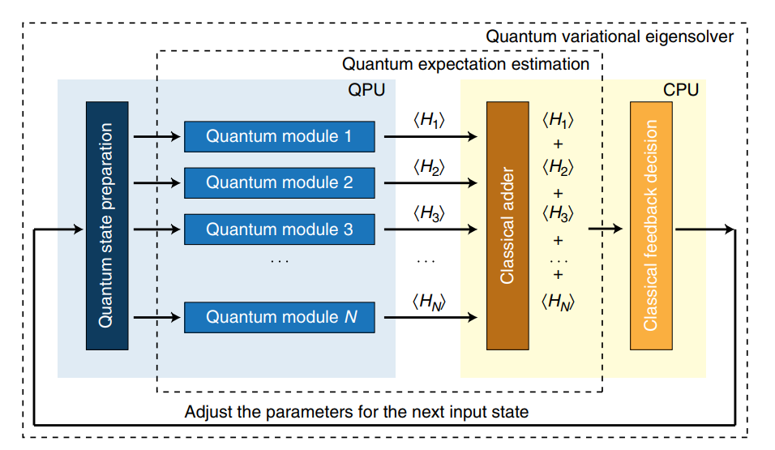

算法教程
=================================

  自从量子计算概念提出以来，人们已经开发了数百种量子算法 [1]_ 。虽然人们对在量子计算机上模拟化学问题十分感兴趣，但目前只有少数量子算法可以作为设计此类量子程序的基石。在应用到材料模拟、生物医药问题的相关量子算法中，许多都需要大量的量子资源，比如大量量子比特或深量子线路。而基于量子-经典混合的算法的变分量子特征值求解算法通过充分利用含噪声的量子比特的计算能力，来实现无完整纠错情况下相关问题的近似和解决。

  变分量子特征值求解算法(Variational Quantum Eigensolver, VQE)是一种混合的量子经典算法，它使用参数化的量子线路来构造波函数，再通过经典计算机来优化这些参数，使哈密顿量的期望值最小化。它的基本流程如图1所示，整体流程分别包括量子初态制备、哈密顿子项 :math:`H_i` 的测量、求和、收敛性判断和参数优化等过程，其中，量子初态制备、哈密顿子项的测量在量子计算机上进行，即图中淡蓝色部分，其它的步骤如求和和参数优化，由经典计算机完成，即图中淡黄色的部分。

.. centered:: 图 1: VQE算法流程 [2]_ 

  具体来讲，VQE可以总结为以下步骤：

(i) 选一组随机参数 :math:`\theta` 
(ii) 在量子计算机上制备试验波函数 :math:`|\psi (\theta) \rangle` 
(iii) 对哈密顿量的各个子项进行测量，然后在经典计算机上进行求和，得到 :math:`|\psi (\theta) \rangle` 的哈密顿量的期望值，即得到分子的能量
(iv) 判断该能量是否满足收敛条件，如果满足，则将该能量作为分子基态能量的近似值，终止计算；如果不满足，则变分优化参数，利用经典优化器产生一组新的参数 :math:`\theta` ，重新制备量子初态
(v) 重复，直到能量收敛

此时，参数化量子线路应该制备好哈密顿量的基态，或非常接近基态的状态。与量子相位估计算法(QPE)相比，VQE需要更少的门数和更短的相干时间。它以多项式的重复次数换取所需的相干时间的减少。因此，它更适合于NISQ时代。

  整个算法中，第一步量子初态制备对后面快速获得正确结果至关重要，特别是应用到化学体系，因为电子是费米子，所以必不可少要做一些额外的预处理。量子初态通常是Hartree-Fock态，它由经典计算得到，但不同的映射方法(mapping)也会对初态的构造有影响。常用的映射方法有Jordan-Wigner(JW)变换、Parity变换及Bravyi-Kitaev(BK)变换等。在确定了映射方式对线路进行初态的构建后，为获得与体系量子终态相近的试验波函数 :math:`|\psi (\theta) \rangle` ，我们需要一个合适的波函数假设(Ansatz)。

  目前，量子计算化学上试验态的制备方法，主要分为两大类，一类为传统计算化学启发拟设，如幺正耦合簇方法(Unitary Coupled Cluster, UCC)，另一类是基于量子计算机硬件特性构造的拟设，即Hardware-Efficient拟设。一旦选择一个拟设，就可以将其对应的线路在量子计算机上执行，来计算目标函数值，在VQE中对应的结果是能量的期望。在经过多步迭代测量至收敛，此时得到的末态是该水平下最接近系统基态的状态，相应的能量也就是求得的基态能量。

  在下面 :math:`H_2O` 分子的案例计算中，我们使用sto-3g基组，活性空间[4,4]，映射方式使用BK变换，拟设采用UCCSD，经典优化器方法使用一阶导数优化方法L-BFGS-B：

.. code-block::

    from pychemiq import Molecules,ChemiQ,QMachineType
    from pychemiq.Transform.Mapping import (bravyi_kitaev,MappingType)
    from pychemiq.Optimizer import vqe_solver
    from pychemiq.Circuit.Ansatz import UCC
    import numpy as np

    # 初始化分子的电子结构参数，包括电荷、基组、原子坐标、自旋多重度、活性空间
    multiplicity = 1
    charge = 0
    basis =  "sto-3g"
    geom = ["O      0.00000000    0.00000000    0.12713100",
            "H      0.00000000    0.75801600   -0.50852400",
            "H      0.00000000   -0.75801600   -0.50852400"]
    active = [4,4]

    mol = Molecules(
        geometry = geom,
        basis    = basis,
        multiplicity = multiplicity,
        charge = charge,
        active = active)

    # 通过BK变换得到泡利算符形式的水分子哈密顿量并打印结果
    fermion_H2O = mol.get_molecular_hamiltonian()
    pauli_H2O = bravyi_kitaev(fermion_H2O)
    print(pauli_H2O)

    # 准备量子线路，需要指定的参数有量子虚拟机类型machine_type，拟设映射类型mapping_type，
    # 泡利哈密顿量的项数pauli_size，电子数目n_elec与量子比特的数目n_qubits
    chemiq = ChemiQ()
    machine_type = QMachineType.CPU_SINGLE_THREAD
    mapping_type = MappingType.Bravyi_Kitaev
    pauli_size = len(pauli_H2O.data())
    n_qubits = mol.n_qubits
    n_elec = mol.n_electrons
    chemiq.prepare_vqe(machine_type,mapping_type,n_elec,pauli_size,n_qubits)

    # 设置簇算符需要的映射方法及簇算符类型，这里我们使用UCCSD拟设
    ansatz = UCC("UCCSD",n_elec,mapping_type,chemiq=chemiq)

    # 指定经典优化器与初始参数并迭代求解
    method = "L-BFGS-B"
    init_para = np.zeros(ansatz.get_para_num())
    solver = vqe_solver(
        method = method,
        pauli = pauli_H2O,
        chemiq = chemiq,
        ansatz = ansatz,
        init_para=init_para)
    result = solver.fun_val
    n_calls = solver.fcalls
    print(result,f"函数共调用{n_calls}次")

    energies = chemiq.get_energy_history()
    print(energies)

打印得到的结果为：

.. code-block::

    -74.97462361862932 函数共调用16次
    [-74.96590114589254, -74.93761158898924, -74.97445676271519, -74.97445676271519, -74.9741228232741, -74.97462271514233, -74.97462271514233, -74.97462047029794, -74.9746233827235, -74.9746233827235, -74.97462239749079, -74.97462357361123, -74.97462357361123, -74.97462251642055, -74.97462361862932, -74.97462361862932]

  为了对比pyChemiq的计算精度，我们将结果与经典计算化学软件PySCF [3]_ 的结果做了比较(PySCF的安装详见 `官网 <https://pyscf.org/install.html>`_ 。在PySCF中我们使用了相同的基组和方法，代码如下：

.. code-block::

    from pyscf import gto, scf, cc

    atom = '''
    O                  0.00000000    0.00000000    0.12713100
    H                  0.00000000    0.75801600   -0.50852400
    H                  0.00000000   -0.75801600   -0.50852400
    '''
    
    mol = gto.M(atom=atom,   # in Angstrom
        basis='STO-3G',
        charge=0,
        spin=0)
    mf = scf.HF(mol).run() 
    mycc = cc.CCSD(mf,frozen=[0,1,2]).run() 
    E_CCSD = mycc.e_tot
    print(E_CCSD)

得到的结果如下：

.. code-block::

    converged SCF energy = -74.9659011458928
    E(CCSD) = -74.97463471534228  E_corr = -0.008733569449437468
    -74.97463471534228

  我们将pyChemiQ打印出来的数据作图，与同水平下的经典CCSD结果进行对比。可以看到随着函数迭代次数的增加，电子能量逐渐收敛至经典结果的能量，如图2所示。而且当函数迭代到第五次时电子能量已经达到了化学精度 :math:`1.6\times 10^3` Hartree。

.. image:: ./picture/energy_convergence_H2O.png
   :align: center
.. centered:: 图 2: 水分子能量收敛曲线

**参考文献**

.. [1]  Ashley Montanaro. Quantum algorithms: an overview. `npj Quantum Information`, 2(1):1–8, 2016
.. [2]  Alberto Peruzzo, Jarrod McClean, Peter Shadbolt, Man-Hong Yung, Xiao-Qi Zhou, Peter J Love, Alán Aspuru-Guzik, and Jeremy L Oąŕbrien. A variational eigenvalue solver on a photonic quantum processor. `Nature communications`, 5(1):1–7, 2014
.. [3]  Qiming Sun, Timothy C Berkelbach, Nick S Blunt, George H Booth, Sheng Guo, Zhendong Li, Junzi Liu, James D McClain, Elvira R Sayfutyarova, Sandeep Sharma, et al. Pyscf: the python-based simulations of chemistry framework. `Wiley Interdisciplinary Reviews: Computational Molecular Science`, 8(1):e1340, 2018.
