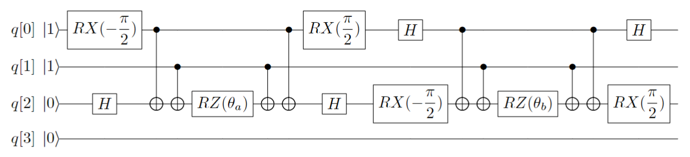
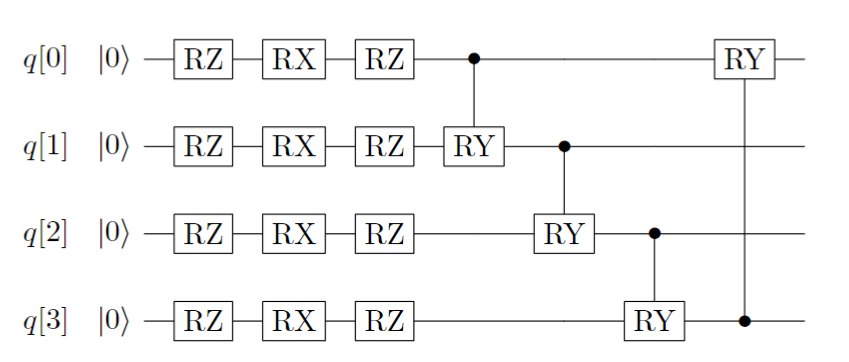
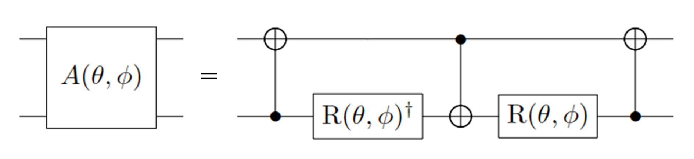
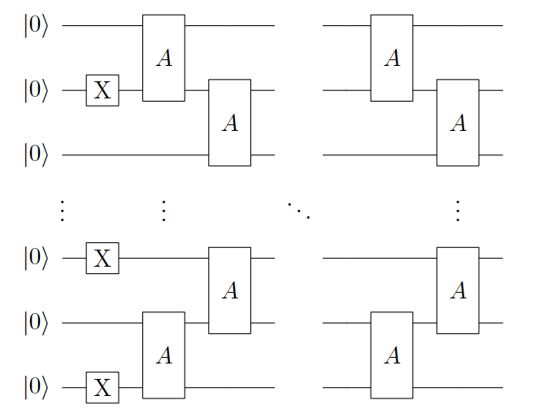

拟设教程
=================================

  为了获得与体系量子终态相近的试验波函数，我们需要一个合适的波函数假设，我们称之为拟设(Ansatz)。并且理论上，假设的试验态与理想波函数越接近，越有利于后面得到正确基态能量。实际上，使用VQE算法在量子计算机上模拟分子体系基态问题，最终都是转换到在量子计算机上对态进行演化，制备出最接近真实基态的试验态波函数。最后在对哈密顿量进行测量求得最小期望值，即基态能量。经典的传统计算化学领域已经发展了多种多样的波函数构造方法，比如组态相互作用法(Configuration Interaction, CI) [1]_ , 耦合簇方法(Coupled-Cluster, CC)等 [2]_ 。

  目前，应用在VQE上的主流拟设主要分为两大类，一类化学启发拟设，如酉正耦合簇(Unitary Coupled-Cluster, UCC) [3]_ ，另一类是基于量子计算机硬件特性构造的拟设，即Hardware-Efficient拟设 [4]_ 。
截至现在，pyChemiQ支持的拟设有Unitary Coupled Cluster(UCC)、Hardware-Efficient、Symmetry-Preserved [5]_ 来构造量子电路，通过自定义的方式构建量子线路拟设详见进阶教程的 :doc:`../04advanced/circuit`。

1. 通过 Unitary Coupled Cluster 拟设构建线路

  在求解体系基态能量选用Hartree-Fock态作为初猜波函数时，由于Hartree-Fock态为单电子组态，没有考虑电子关联能，所以要将其制备成多电子组态(也就是纠缠态)，以使测量结果达到化学精度。UCC中的CC即是量子化学中的耦合簇算符 :math:`e^{\hat{T}}`，它从Hartree-Fock分子轨道出发，通过指数形式的耦合算符得到真实体系的波函数。详细的理论请查看 :doc:`../05theory/theoreticalbackground` 的拟设小节。下面我们示例的是氢分子单激发算符 :math:`a_2^{\dagger}a_0 - a_0^{\dagger}a_2` 的量子线路。

.. centered:: 图 1: 单激发算符 :math:`a_2^{\dagger}a_0 - a_0^{\dagger}a_2` 的量子线路

2. 通过 Hardware-Efficient 拟设构建线路

  基于量子计算机硬件特性构造的拟设是各种变分量子算法中经常使用的一种拟设。 当我们对要解决的问题信息知之甚少时，我们可以使用基本的量子门来搜索目标。 通常基于硬件特性构造的拟设由许多层组成，每一层的量子线路上都由两部分组成：一是每个量子比特上的单比特旋转门（RZRXRZ），二是相邻量子比特上两个纠缠比特形成的受控逻辑门（受控RY门）。 单层的量子线路如下图所示：

.. centered:: 图 2: 基于 Hardware-Efficient 拟设的单层量子线路

3. 通过 Symmetry-Preserved 拟设构建线路

  基于 Symmetry-Preserved 拟设是通过一个特定纠缠门(entangling gate) :math:`A(\theta, \phi)` 作为组成单元，来构建保持粒子数守恒、时间反演对称性与自旋对称性的拟设。在 :math:`|00\rangle, |01\rangle, |10\rangle, |11\rangle` 为基下， :math:`A(\theta, \phi)` 可以被表示为：

.. math::
   A(\theta, \phi) = \begin{pmatrix} 1 & 0 & 0 & 0 \\ 0 & \cos \theta & e^{i\phi}\sin \theta & 0 \\ 0 & e^{-i\phi}\sin \theta & -\cos \theta & 0 \\ 0 & 0 & 0 & 1  \\ \end{pmatrix}

该纠缠门分解成单、双比特基础门为：

.. centered:: 图 3: :math:`A(\theta, \phi)` 门的分解。其中: :math:`R(\theta, \phi)  = R_z(\phi + \pi) R_y(\theta + \pi/2), R_z(\theta) = exp(−i \theta \sigma_z/2), R_y(\phi) = exp(−i \phi \sigma_y/2)`

由 :math:`A(\theta, \phi)` 与X门构建的Symmetry-Preserved 拟设的量子线路如下图所示：

.. centered:: 图 4: 基于 Symmetry-Preserved 拟设的单层量子线路

----------

  在基础教程中代码示例中使用的都是UCCSD, 比如计算LiH分子:

.. code-block::

    from pychemiq import Molecules,ChemiQ,QMachineType
    from pychemiq.Transform.Mapping import jordan_wigner,MappingType
    from pychemiq.Optimizer import vqe_solver
    from pychemiq.Circuit.Ansatz import UCC
    import numpy as np

    multiplicity = 1
    charge = 0
    basis =  "sto-3g"
    geom = ["Li     0.00000000    0.00000000    0.37770300",
            "H      0.00000000    0.00000000   -1.13310900"]
    mol = Molecules(
        geometry = geom,
        basis    = basis,
        multiplicity = multiplicity,
        charge = charge)
    fermion_LiH = mol.get_molecular_hamiltonian()
    pauli_LiH = jordan_wigner(fermion_LiH)

    chemiq = ChemiQ()
    machine_type = QMachineType.CPU_SINGLE_THREAD
    mapping_type = MappingType.Jordan_Wigner
    pauli_size = len(pauli_LiH.data())
    n_qubits = mol.n_qubits
    n_elec = mol.n_electrons
    chemiq.prepare_vqe(machine_type,mapping_type,n_elec,pauli_size,n_qubits)

    # 设置ansatz拟设类型，这里使用的是UCCSD拟设
    ansatz = UCC("UCCSD",n_elec,mapping_type,chemiq=chemiq)

下面我们来演示如何使用pyChemiQ调用其他拟设：

.. code-block::

    # 使用UCCS拟设
    from pychemiq.Circuit.Ansatz import UCC
    ansatz = UCC("UCCS",n_elec,mapping_type,chemiq=chemiq)
    # 使用UCCD拟设
    ansatz = UCC("UCCD",n_elec,mapping_type,chemiq=chemiq)

    # 使用HardwareEfficient拟设
    from pychemiq.Circuit.Ansatz import HardwareEfficient
    ansatz = HardwareEfficient(n_elec,chemiq = chemiq)

    # 使用SymmetryPreserved拟设
    from pychemiq.Circuit.Ansatz import SymmetryPreserved
    ansatz = SymmetryPreserved(n_elec,chemiq = chemiq)

指定拟设类型后，就可以自动生成含参的量子线路，下一步就是指定经典优化器与初始参数并迭代求解：

.. code-block::

        method = "SLSQP"
        init_para = np.zeros(ansatz.get_para_num())
        solver = vqe_solver(
                method = method,
                pauli = pauli_LiH,
                chemiq = chemiq,
                ansatz = ansatz,
                init_para=init_para)
        result = solver.fun_val
        print(result)
        
在其他参数不变的情况下，使用不同拟设的结果如下：

.. list-table::
    :align: center

    *   -   ansatz
        -   Energy(Hartree)
    *   -   UCCS
        -   -7.863382128921046
    *   -   UCCD
        -   -7.882121742611668
    *   -   UCCSD
        -   -7.882513551487563
    *   -   HE
        -   -7.8633821289210415
    *   -   SP
        -   -5.602230693394411 

与同基组下的经典Full CI结果-7.882526376869对比，我们发现UCCD与UCCSD拟设已经达到了化学精度 :math:`1.6\times 10^3` Hartree。

**参考文献**

.. [1]  Peter J Knowles and Nicholas C Handy. A new determinant-based full configuration interaction method. `Chemical physics letters`, 111(4-5):315–321, 1984.
.. [2]  Rodney J Bartlett. Many-body perturbation theory and coupled cluster theory for electron correlation in molecules. `Annual review of physical chemistry`, 32(1):359–401, 1981.
.. [3]  Andrew G Taube and Rodney J Bartlett. New perspectives on unitary coupled-cluster theory. `International journal of quantum chemistry`, 106(15):3393–3401, 2006.
.. [4]  Abhinav Kandala, Antonio Mezzacapo, Kristan Temme, Maika Takita, Markus Brink,Jerry M Chow, and Jay M Gambetta. Hardware-efficient variational quantum eigensolver for small molecules and quantum magnets. `Nature`, 549(7671):242–246, 2017.
.. [5]  Bryan T Gard, Linghua Zhu, George S Barron, Nicholas J Mayhall, Sophia E Economou, and Edwin Barnes. Efficient symmetry-preserving state preparation circuits for the variational quantum eigensolver algorithm. `npj Quantum Information`, 6(1):10, 2020.