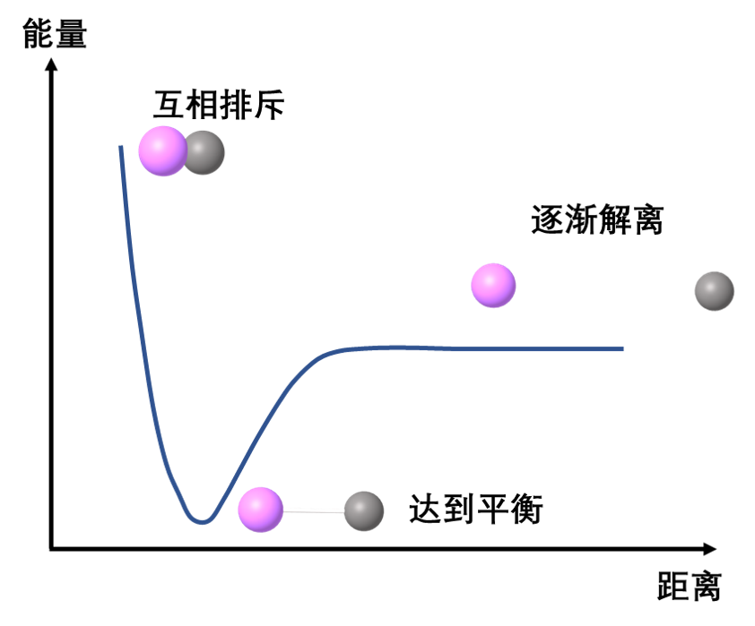
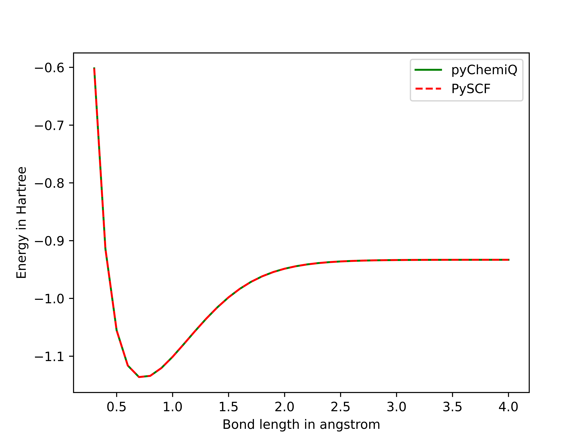

功能教程
=================================

  我们都知道化学反应的本质是旧化学键断裂和新化学键形成的过程。而化学键的“断裂”和“形成”只是我们宏观上对其定性的描述。实际上，我们之所以说化学键“形成”，是因为分子间原子沿着反应坐标的方向相互靠近，处于某一相对位置时整个体系的能量最低，最稳定。而化学键“断裂”则是在外界输入能量后，分子间的原子克服了能垒，沿着反应坐标的方向相互远离。在计算化学中，我们可以用势能面 (Potential Energy Surface, PES) 来描述分子在其原子的不同位置的能量，从而帮助我们理解化学反应的进程。

.. centered:: 图 1: 双分子原子的势能面

  比如，随着分子内某一根键的增长，能量会随着变化，做能量-键长的变化曲线，称为势能曲线，如图1；如果做分子的势能随两种坐标参数变化的图像，你会发现这是一个面（因为共有3个量：两种坐标变量加能量，组成三维空间），就叫势能面，如图2；以此类推，整个分子势能随着所有可能的原子坐标变量变化，是一个在多维空间中的复杂势能面(hypersurface)，统称势能面 [1]_ 。

.. image:: ./picture/PES.png
   :align: center
   :scale: 80%
.. centered:: 图 2: 水分子势能面: 势能最低点对应优化后的水分子结构，O-H 键长 0.0958 nm， H-O-H夹角为 :math:`104.5^{\circ}` 。图引自 [2]_ 

  在这个教程中，我们会演示如何使用pyChemiQ得到分子的势能面的数据，并使用matplotlib绘制势能面。
这里我们以双原子分子 :math:`H_2` 为例，映射方式使用JW变换，拟设采用UCCSD，经典优化器使用SLSQP，最后我们再将pyChemiQ的势能曲线与PySCF的势能曲线进行对比：

.. code-block::

    # 导入所需的包
    from pychemiq import Molecules,ChemiQ,QMachineType
    from pychemiq.Transform.Mapping import (jordan_wigner,MappingType)
    from pychemiq.Optimizer import vqe_solver
    from pychemiq.Circuit.Ansatz import UCC
    import numpy as np
    from pyscf import gto, scf, cc
    import matplotlib.pyplot as plt

    # 进行势能面扫描：先初始化参数，再构建不同键长下的分子体系，进行多次单点能计算
    basis = 'sto-3g'
    multiplicity = 1
    charge=0

    ## 定义步长间隔、步数
    bond_length_interval = 0.1
    n_points = 40
    bond_lengths = []
    energies = []
    for point in range(3, n_points + 1):
        bond_length = bond_length_interval * point
        bond_lengths += [bond_length]
        geometry = ["H 0 0 0", f"H 0 0 {bond_length}"]
    
        mol = Molecules(
            geometry = geometry,
            basis    = basis,
            multiplicity = multiplicity,
            charge = charge)
    
        fermion_H2 = mol.get_molecular_hamiltonian()
        pauli_H2 = jordan_wigner(fermion_H2)
    
        chemiq = ChemiQ()
        machine_type = QMachineType.CPU_SINGLE_THREAD
        mapping_type = MappingType.Jordan_Wigner
        pauli_size = len(pauli_H2.data())
        n_qubits = mol.n_qubits
        n_elec = mol.n_electrons
        chemiq.prepare_vqe(machine_type,mapping_type,n_elec,pauli_size,n_qubits)
        ansatz = UCC("UCCSD",n_elec,mapping_type,chemiq=chemiq)
    
        method = "SLSQP"
        init_para = np.zeros(ansatz.get_para_num())
        solver = vqe_solver(
                method = method,
                pauli = pauli_H2,
                chemiq = chemiq,
                ansatz = ansatz,
                init_para=init_para)
        energy = solver.fun_val
        energies += [energy]

    # 使用经典计算化学软件PySCF来计算氢分子的在不同键长下的能量
    pyscf_energies = []
    bond_length_interval = 0.1
    n_points = 40
    for point in range(3, n_points + 1):
        bond_length = bond_length_interval * point
        atom = f'H 0 0 0; H 0 0 {bond_length}'
    
        mol = gto.M(atom=atom,   # in Angstrom
                basis='STO-3G',
                charge=0,
                spin=0)
        mf = scf.HF(mol).run() 
        mycc = cc.CCSD(mf).run() 
        pyscf_energies += [mycc.e_tot]

    # 最后我们使用matplotlib来绘制氢分子势能面
    plt.figure()
    plt.plot(bond_lengths, energies, '-g',label='pyChemiQ')
    plt.plot(bond_lengths, pyscf_energies, '--r',label='PySCF')
    plt.ylabel('Energy in Hartree')
    plt.xlabel('Bond length in angstrom')
    plt.legend()
    plt.show()

得到的氢分子势能图对比如下图所示，由于二者计算结果过于接近，势能面大部分处于重合的状态。

.. centered:: 图 3: pyChemiQ与PySCF得到的氢分子势能面

**参考文献**

.. [1]  Baidu. https://baike.baidu.com/item/%E5%8A%BF%E8%83%BD%E9%9D%A2/6295493, last access on 6th January, 2023
.. [2]  Wikipedia. Potential energy surface. https://en.wikipedia.org/wiki/Potential_energy_surface, last access on 6th January, 2023
