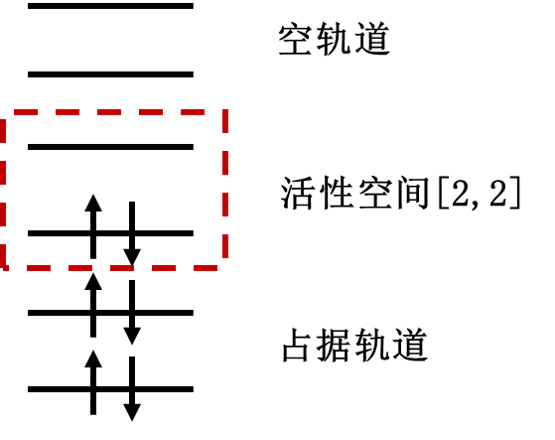

哈密顿量教程
=================================

  量子化学的基本目标之一是揭示分子结构和性质的关系。我们可以根据描述分子中电子的波函数计算出准确的分子性质，电子波函数满足电子薛定谔方程。系统的电子薛定谔方程可以写为式(1)。 :math:`|\psi_{el}\rangle` 是系统的电子波函数， :math:`\hat{H}_{el}` 是系统中电子的Hamiltonian，为式(2)的形式(原子单位)，式中 :math:`A` 指的是核， :math:`i,j` 指的是电子。第一项是电子的动能，第二项表示电子与核的库仑吸引力， :math:`r_{Ai}` 是电子 :math:`i` 与原子序数为 :math:`Z_{A}` 的核 :math:`A` 之间的距离，第三项表示电子与电子排斥作用， :math:`r_{ij}` 是电子 :math:`i` 与电子 :math:`j` 之间的距离。该式的求解是建立在电子运动在固定不动的原子核周围之上，因为在原子中核的质量比电子质量大得多，运动比电子慢。所以可以忽略原子核的效应，假定电子运动在固定的原子核周围来近似。
  
.. math::
    \hat{H}_{el}|\psi_{el}\rangle = E_{el}|\psi_{el}\rangle     (1)

.. math::
    \hat{H}_{el}=-\frac{1}{2} \sum_{i} \nabla_{i}^{2}-\sum_{A,i}\frac{Z_{A}}{r_{A i}}+\sum_{i>j} \frac{1}{r_{ij}}     (2)

  所以我们的核心目标可以描述为：求解在特定分子体系下定态电子薛定谔方程，得到的解为体系处于不同定态下的本征值，即电子能量。根据变分原理(variational principle)可知，求得的最小特征值为体系的基态能量 :math:`E_0` (ground-state energy), 对应的系统状态为基态(ground-state)。

.. math::
    E=\dfrac{\langle \psi |\hat{H}| \psi \rangle}{\langle \psi|\psi \rangle} \geq E_0

  在二次量子化的形式中(second quantization)，电子波函数可以表示成占据数态(occupation number state),这里采用轨道序数从右向左依次递增的约定,如式(3)所示。其中N为电子数，M为自旋轨道数。当自旋轨道 :math:`\chi_p` 被电子占据时， :math:`n_p` 为1；反之，未被占据时， :math:`n_p` 为0。换句话说，占据数态是一组只包含0和1的二元的数串，其长度是自旋轨道的数量，每一位上的1表示该编号下的自旋轨道是被占据的。由此我们可以将一系列产生算符作用在真空态 :math:`|\rangle` 来构造任何系统的Hartree-Fock态。如式(4)所示。式中 :math:`a_{i}^{\dagger}` 为产生算符(creation operator)，它的作用是在第i个自旋轨道上产生一个电子，同理，定义 :math:`a_{j}` 为湮灭算符(annihilation operator)，它的作用是在第j个自旋轨道上湮灭一个电子。

.. math::
    \Phi_{HF}(\chi_1,\chi_2,\cdots,\chi_N)=|n_{M-1},n_{M-2},\cdots,n_0\rangle     (3)

.. math::
    |n_{M-1},n_{M-2},\cdots,n_0\rangle = a_0^{\dagger} a_1^{\dagger} \cdots a_N^{\dagger}|\rangle = \prod_{i=1}^N a_i^{\dagger}|\rangle     (4)

  二次量子化后，电子的Hamiltonian表示成式(5)的形式 [1]_，该式中第一项为是单粒子算符，第二项为双粒子算符，下标 :math:`pqrs` 分别代表不同电子自旋轨道，其中 :math:`h_{pq}` 、 :math:`h_{pqrs}` 分别代表单、双电子积分。如果选定基组，我们就可以确定积分的具体值。

.. math::
    \hat{H}_{el}=\sum_{pq} h_{pq} a_{p}^{\dagger} a_{q}+\frac{1}{2} \sum_{pqrs} h_{pqrs} a_{p}^{\dagger} a_{q}^{\dagger} a_{s} a_{r}     (5)

  在pyChemiQ中，利用方法get_molecular_hamiltonian()可以得到分子的费米子哈密顿量。下面我们以氢分子为例，展示得到的哈密顿量。

.. code-block::

    from pychemiq import Molecules

  在 pychemiq.Molecules 这个模块中，我们可以初始化分子的电子结构参数, 包括分子的几何构型(坐标单位为angstrom)、基组、电荷、自旋多重度，将分子信息存储在对象中。输入参数后执行经典 hartree-fock计算。

.. code-block::

    multiplicity = 1
    charge = 0
    basis =  "sto-3g"
    geom = "H 0 0 0,H 0 0 0.74"
    mol = Molecules(
        geometry = geom,
        basis    = basis,
        multiplicity = multiplicity,
        charge = charge)

  通过调用get_molecular_hamiltonian()可以得到费米子形式的分子Hamiltonian子项及每项的系数。以下是示例代码及氢分子的费米子Hamiltonian打印结果。

.. code-block::

    fermion_H2 = mol.get_molecular_hamiltonian()
    print(fermion_H2)

    {
    : 0.715104
    0+ 0 : -1.253310
    1+ 0+ 1 0 : -0.674756
    1+ 0+ 3 2 : -0.181210
    1+ 1 : -1.253310
    2+ 0+ 2 0 : -0.482501
    2+ 1+ 2 1 : -0.663711
    2+ 1+ 3 0 : 0.181210
    2+ 2 : -0.475069
    3+ 0+ 2 1 : 0.181210
    3+ 0+ 3 0 : -0.663711
    3+ 1+ 3 1 : -0.482501
    3+ 2+ 1 0 : -0.181210
    3+ 2+ 3 2 : -0.697652
    3+ 3 : -0.475069
    }

  另外，pyChemiQ也支持活性空间和冻结轨道的设置，通过限制电子和所激发的轨道，只考虑部分的电子激发到部分的轨道上的激发组态。适当使用活性空间和冻结轨道可以在保证化学精度的同时减少模拟所需要的量子比特数目。

  活性空间方法(即经典中的CASSCF)把分子轨道分为三个部分：电子占据轨道，活性轨道和空轨道。其中电子占据轨道始终保持电子双占据，空轨道则始终不占据电子。有限的电子只会在活性轨道里面自由跃迁。我们定义活性空间[m,n]，其中m为活性轨道的数目，n为活性电子的数目，此时的计算包含了n个电子在m个轨道上的所有排列。活性轨道的选取一般在是在HOMO与LUMO位置，因为处在这些分子轨道中的电子就像原子轨道中的价电子一样是化学反应中最活泼的电子，是化学反应的关键。下图中就是活性空间[2,2]的示例：

.. centered:: 图 1: 活性空间设置中分子轨道的划分

  在pyChemiQ中，我们在pychemiq.Molecules中通过参数active来指定活性空间。比如我们指定活性空间[2,2]来得到LiH的哈密顿量：

.. code-block::

    multiplicity = 1
    charge = 0
    basis =  "sto-3g"
    geom = ["Li     0.00000000    0.00000000    0.37770300",
            "H      0.00000000    0.00000000   -1.13310900"]
    active = [2,2]
    mol = Molecules(
        geometry = geom,
        basis    = basis,
        multiplicity = multiplicity,
        charge = charge,
        active = active)
    fermion_LiH = mol.get_molecular_hamiltonian()

  pyChemiQ对冻结轨道数目的设置是通过参数nfrozen来指定的，我们默认从能量最低的分子轨道算起开始冻结该轨道及轨道上的电子。比如下面这个例子我们冻结一个空间轨道来得到LiH的哈密顿量：

.. code-block::

    multiplicity = 1
    charge = 0
    basis =  "sto-3g"
    geom = ["Li     0.00000000    0.00000000    0.37770300",
            "H      0.00000000    0.00000000   -1.13310900"]
    nfrozen = 1
    mol = Molecules(
        geometry = geom,
        basis    = basis,
        multiplicity = multiplicity,
        charge = charge,
        nfrozen = nfrozen)
    fermion_LiH = mol.get_molecular_hamiltonian()

**参考文献**

.. [1]  Attila Szabo and Neil S Ostlund. `Modern quantum chemistry: introduction to advanced electronic structure theory`. Courier Corporation, 2012.