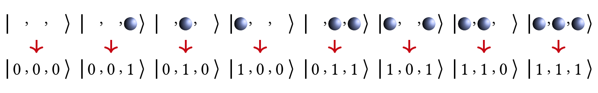

映射教程
=================================

  为了在量子计算机上模拟电子结构问题，我们需要一个映射关系，将电子的费米子算符映射(mapping)到量子计算机的泡利算符(pauli operator, 即pauli X矩阵, pauli Y矩阵, pauli Z矩阵, 单位矩阵I)。目前，比较常见的映射有Jordan-Wigner(JW)变换 [1]_、Bravyi-Kitaev(BK)变换 [2]_ 和Parity变换 [3]_ 等。不同的变换所得到的量子线路深度可能有所不同，但他们的功能都是一致的，都是为了将费米子系统映射到量子计算机中去。

  这里，我们以JW变换为例展示三个自旋轨道的映射示意图，如图1所示。可以看出，在JW变换下，每一个量子比特标识一个费米轨道，占据态和非占据态分别映射到量子比特的 :math:`|1\rangle` 态和 :math:`|0\rangle` 态。此时，轨道和量子比特是一一对应的。

.. centered:: 图 1: 三个自旋轨道的JW变换示意图.图引自 [4]_ 

  在pychemiq.Transform这个模块中，一个非常重要的子模块是pychemiq.Transform.Mapping，实现的是就是把费米子算符映射成为泡利算符。目前pyChemiQ支持的映射方式有Jordan-Wigner(JW)变换、Bravyi-Kitaev(BK)变换、Parity变换和Multilayer Segmented
Parity(MSP)变换 [5]_ 。可以通过如下方式调用相应的包：

.. code-block::

    from pychemiq.Transform.Mapping import (
    jordan_wigner,
    bravyi_kitaev,
    parity,
    segment_parity)

  例如我们使用JW变换将上节氢分子的费米子Hamiltonian映射成泡利形式，示例代码及打印结果如下：

.. code-block::

    # 先初始化得到氢分子的费米子Hamiltonian
    from pychemiq import Molecules
    multiplicity = 1
    charge = 0
    basis =  "sto-3g"
    geom = "H 0 0 0,H 0 0 0.74"
    mol = Molecules(
        geometry = geom,
        basis    = basis,
        multiplicity = multiplicity,
        charge = charge)
    fermion_H2 = mol.get_molecular_hamiltonian()

    # 使用JW变换将得到的氢分子的费米子Hamiltonian映射成泡利形式
    pauli_H2 = jordan_wigner(fermion_H2)
    print(pauli_H2)

    {
    "" : -0.097066,
    "X0 X1 Y2 Y3" : -0.045303,
    "X0 Y1 Y2 X3" : 0.045303,
    "Y0 X1 X2 Y3" : 0.045303,
    "Y0 Y1 X2 X3" : -0.045303,
    "Z0" : 0.171413,
    "Z0 Z1" : 0.168689,
    "Z0 Z2" : 0.120625,
    "Z0 Z3" : 0.165928,
    "Z1" : 0.171413,
    "Z1 Z2" : 0.165928,
    "Z1 Z3" : 0.120625,
    "Z2" : -0.223432,
    "Z2 Z3" : 0.174413,
    "Z3" : -0.223432
    }

  除此之外，pyChemiQ也支持自行构建费米子算符或泡利算符来自定义哈密顿量。详见进阶教程第一节。

**参考文献**

.. [1] E Wigner and Pascual Jordan. Über das paulische äquivalenzverbot. `Z. Phys`, 47:631, 1928.
.. [2] Sergey B Bravyi and Alexei Yu Kitaev. Fermionic quantum computation. `Annals of Physics`, 298(1):210–226, 2002.
.. [3] Jacob T Seeley, Martin J Richard, and Peter J Love. The bravyi-kitaev transformation for quantum computation of electronic structure. `The Journal of chemical physics`, 137(22):224109, 2012.
.. [4] Bela Bauer, Sergey Bravyi, Mario Motta, and Garnet Kin-Lic Chan. Quantum algorithms for quantum chemistry and quantum materials science. `Chemical Reviews` , 120(22):12685–12717, 2020.
.. [5]  Qing-Song Li, Huan-Yu Liu, Qingchun Wang, Yu-Chun Wu, and Guo-Ping Guo. A unified framework of transformations based on the jordan–wigner transformation. `The Journal of Chemical Physics`, 157(13):134104, 2022.