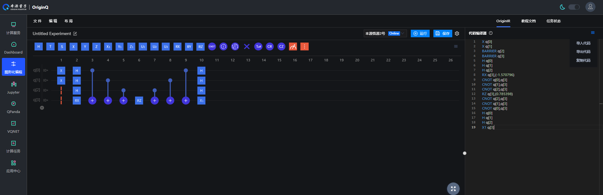

量子线路教程
=================================

  在基础教程中的拟设教程我们展示了如何使用Unitary Coupled-Cluster、Hardware-Efficient、Symmetry-Preserved 接口来直接搭建量子线路，这个教程展示的是如何使用用户自定义的方式来构建量子线路拟设。

  调用 pychemiq.Circuit.Ansatz 模块下的UserDefine函数，我们可以通过以下两种方式自定义构建线路：第一种是通过将originIR格式的代码输入到circuit参数中自定义量子线路，第二种是通过输入耦合簇激发项的费米子算符fermion参数来构建量子线路。该函数的接口介绍如下：

.. py:function:: UserDefine(n_electrons, circuit=None, fermion=None, chemiq=None)

      使用用户自定义的方式构建量子线路拟设。

      :param int n_electrons: 输入分子体系的电子数。
      :param str circuit: 构建量子线路的originIR字符串。
      :param FermionOperator fermion: 构建量子线路的费米子算符类。
      :param ChemiQ chemiq: 指定chemiq类。详见pychemiq.ChemiQ。

      :return: 输出自定义拟设的AbstractAnsatz类。

**1. 通过将originIR输入到circuit参数中自定义量子线路**

  我们可以通过两种方法获得originIR格式的量子线路，第一种方法是通过本源量子云平台的图形化编程界面搭建量子线路。如下图，先在本源量子云平台 `图形化编程界面 <https://qcloud.originqc.com.cn/zh/computerServies/quantumVm/5/0/5>`_ 搭建量子线路。

.. centered:: 图 1: 通过本源量子云平台图形化编程界面搭建量子线路

搭建完量子线路后导出如下的originIR格式的字符串，再将其输入到UserDefine函数中的circuit参数即可。

.. code-block::

    X q[0]
    X q[1]
    BARRIER q[2]
    BARRIER q[3]
    H q[0]
    H q[1]
    H q[2]
    RX q[3],(-1.570796)
    CNOT q[0],q[3]
    CNOT q[1],q[3]
    CNOT q[2],q[3]
    RZ q[3],(0.785398)
    CNOT q[2],q[3]
    CNOT q[1],q[3]
    CNOT q[0],q[3]
    H q[0]
    H q[1]
    H q[2]
    X1 q[3]

---------

**接口示例：**

.. code:: 

    from pychemiq import Molecules,ChemiQ,QMachineType
    from pychemiq.Transform.Mapping import jordan_wigner,MappingType
    from pychemiq.Optimizer import vqe_solver
    from pychemiq.Circuit.Ansatz import UserDefine
    import numpy as np

    multiplicity = 1
    charge = 0
    basis =  "sto-3g"
    geom = "H 0 0 0,H 0 0 0.74"
    mol = Molecules(
          geometry = geom,
          basis    = basis,
          multiplicity = multiplicity,
          charge = charge)
    fermion_H2 = mol.get_molecular_hamiltonian()
    pauli_H2 = jordan_wigner(fermion_H2)

    chemiq = ChemiQ()
    machine_type = QMachineType.CPU_SINGLE_THREAD
    mapping_type = MappingType.Jordan_Wigner
    pauli_size = len(pauli_H2.data())
    n_qubits = mol.n_qubits
    n_elec = mol.n_electrons
    chemiq.prepare_vqe(machine_type,mapping_type,n_elec,pauli_size,n_qubits)

    # 使用自定义量子线路，将originIR格式的字符串输入到circuit参数中
    circuit = """
        X q[0]
        X q[1]
        BARRIER q[2]
        BARRIER q[3]
        H q[0]
        H q[1]
        H q[2]
        RX q[3],(-1.5707963)
        CNOT q[0],q[3]
        CNOT q[1],q[3]
        CNOT q[2],q[3]
        RZ q[3],(0.785398)
        CNOT q[2],q[3]
        CNOT q[1],q[3]
        CNOT q[0],q[3]
        H q[0]
        H q[1]
        H q[2]
        RX q[3],(1.5707963)
    """
    ansatz = UserDefine(n_elec, circuit=circuit, chemiq=chemiq)

    # 最后指定经典优化器与初始参数并迭代求解
    method = "SLSQP"
    init_para = np.zeros(ansatz.get_para_num())
    solver = vqe_solver(
            method = method,
            pauli = pauli_H2,
            chemiq = chemiq,
            ansatz = ansatz,
            init_para=init_para)
    result = solver.fun_val
    print(result)

打印得到的结果为：0.7151043390810803。
这里的两个RX门为固定参数，不参与变分线路的参数优化。对于有参数的旋转门，默认参数不为 :math:`\pi /2` 或 :math:`-\pi /2` 的是待优化的参数。

  第二种获得originIR格式的量子线路是通过pyqpanda中的convert_qprog_to_originir函数获得，详细教程见 `量子程序转化OriginIR <https://pyqpanda-toturial.readthedocs.io/zh/latest/QProgToOriginIR.html>`_ 。这里我们以拟设教程中提到的 Hardware-Efficient 拟设的单层线路为例，演示如何通过量子程序获得OriginIR。
下面我们先构建HE拟设线路QProg，再通过函数convert_qprog_to_originir(prog, machine)将其转换成originIR格式。

.. code:: 

    import pyqpanda as pq
    import numpy as np

    def HE_ansatz(machine_type,qn, para):  
        machine = pq.init_quantum_machine(machine_type)
        qlist=pq.qAlloc_many(qn)   
    
        # 构建HE拟设线路
        prog = pq.QProg()
        for i in range(qn):
            prog.insert(pq.RZ(qlist[i], para[4*i]))  
            prog.insert(pq.RX(qlist[i], para[4*i+1]))
            prog.insert(pq.RZ(qlist[i], para[4*i+2]))
        
        for j in range(qn-1):
            ry_control = pq.RY(qlist[j+1], para[4*j+3]).control(qlist[j])
            prog.insert(ry_control)
        
        ry_last = pq.RY(qlist[0], para[4*qn-1]).control(qlist[qn-1])                                                      
        prog.insert(ry_last)
        
        #print(prog)
        OriginIR=pq.convert_qprog_to_originir(prog, machine)
        print(OriginIR)
        return OriginIR

下面我们定义主函数来获得该参数下的originIR格式的量子线路。这里我们以四个量子比特为例：

.. code:: 

    if __name__ == "__main__":
        machine_type = pq.QMachineType.CPU
        qn=4
        para=np.random.random(4*qn)
        HE_ansatz(machine_type,qn, para)

打印得到的结果为：

.. code:: 

    QINIT 4
    CREG 0
    RZ q[0],(0.6639123)
    RX q[0],(0.69876429)
    RZ q[0],(0.87923246)
    RZ q[1],(0.50633782)
    RX q[1],(0.57366393)
    RZ q[1],(0.51500428)
    RZ q[2],(0.41510053)
    RX q[2],(0.58136057)
    RZ q[2],(0.60506401)
    RZ q[3],(0.99153126)
    RX q[3],(0.89568316)
    RZ q[3],(0.6493124)
    CONTROL q[0]
    RY q[1],(0.011800026)
    ENDCONTROL
    CONTROL q[1]
    RY q[2],(0.92157183)
    ENDCONTROL
    CONTROL q[2]
    RY q[3],(0.64791654)
    ENDCONTROL
    CONTROL q[3]
    RY q[0],(0.50756615)
    ENDCONTROL

将前两行删去后即可输入到UserDefine函数中的circuit参数中，如第一种方式所示。

**2. 通过输入耦合簇激发项的费米子算符fermion参数来构建量子线路**

  第二种方式是通过输入耦合簇激发项的费米子算符fermion参数来构建量子线路。例如，对于4个量子比特，2电子体系的双激发耦合簇算符，自旋轨道0和1为占据态，激发后的耦合簇项为：01->23。

.. centered:: 图 2: 四个自旋轨道的氢分子体系由基态到双激发态

  如要构建如上的激发费米子算符我们需要用 FermionOperator 来构建或者通过调用 pychemiq.Utils 模块中的函数 get_cc() 来构建。

.. code:: 

    from pychemiq import FermionOperator
    a = FermionOperator("3+ 2+ 1 0", 1)
    print(a) 

    from pychemiq.Utils import get_cc_n_term,get_cc
    import numpy as np
    n_para = get_cc_n_term(4,2,"CCD")
    para = np.ones(n_para)
    cc_fermion = get_cc(4,2,para,"CCD")
    print(cc_fermion)

二者打印的结果都为：

.. code:: 

    {
    3+ 2+ 1 0 : 1.000000
    }

将得到的激发费米子算符输入到UserDefine函数中的fermion参数即可。这里我们以氢分子为例：

---------

**接口示例：**

.. code:: 

    from pychemiq import Molecules,ChemiQ,QMachineType,FermionOperator
    from pychemiq.Transform.Mapping import jordan_wigner,MappingType
    from pychemiq.Optimizer import vqe_solver
    from pychemiq.Circuit.Ansatz import UserDefine
    import numpy as np

    multiplicity = 1
    charge = 0
    basis =  "sto-3g"
    geom = "H 0 0 0,H 0 0 0.74"
    mol = Molecules(
          geometry = geom,
          basis    = basis,
          multiplicity = multiplicity,
          charge = charge)
    fermion_H2 = mol.get_molecular_hamiltonian()
    pauli_H2 = jordan_wigner(fermion_H2)

    chemiq = ChemiQ()
    machine_type = QMachineType.CPU_SINGLE_THREAD
    mapping_type = MappingType.Jordan_Wigner
    pauli_size = len(pauli_H2.data())
    n_qubits = mol.n_qubits
    n_elec = mol.n_electrons
    chemiq.prepare_vqe(machine_type,mapping_type,n_elec,pauli_size,n_qubits)

    # 使用自定义量子线路，将自定义的激发费米子算符输入到fermion参数中
    a = FermionOperator("3+ 2+ 1 0", 1)
    ansatz = UserDefine(n_elec, fermion=a, chemiq=chemiq)

    # 最后指定经典优化器与初始参数并迭代求解
    method = "SLSQP"
    init_para = np.zeros(ansatz.get_para_num())
    solver = vqe_solver(
            method = method,
            pauli = pauli_H2,
            chemiq = chemiq,
            ansatz = ansatz,
            init_para=init_para)
    result = solver.fun_val
    print(result)

打印得到的结果为：-1.1372838304374302
