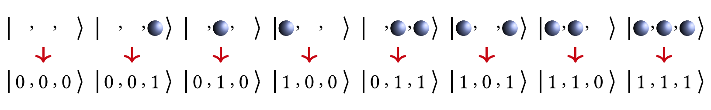

理论基础
=================================

2.1 电子结构问题
----------------------------------
  在对一个 :math:`N` 电子体系计算模拟时，往往需要求解薛定谔方程，这就涉及到了 :math:`3N` 维波函数的求解。含时(time-dependent)薛定谔方程如式(1)所示 [1]_ ，其中 :math:`\hat{\mathrm{H}}` 是系统的Hamiltonian，它描述了整个系统的全部信息. :math:`\psi(x,t)\rangle` 是系统随时间变化的多体波函数。
当粒子处于与时间无关的势场中时,即势能只与粒子的位置 :math:`x` 有关。在经典力学中，若势能与时间无关，总能量就是一个运动常量；在量子力学中则存在着能量完全确定的态。薛定谔方程中粒子坐标 :math:`x` 和时间 :math:`t` 独立。分离变量后，我们可以得到不含时(time-independent)的薛定谔方程，即定态(stationary states) 薛定谔方程(物理上喜欢叫它能量本征方程，因此定态也叫能量本征态),如式(2)所示。这种形式的薛定谔方程是化学中最常见的也是最感兴趣的形式。

.. math::
    \hbar \frac{\partial}{\partial t}|\Psi(x,t)\rangle=\hat{H}|\Psi(x,t)\rangle \qquad  (1)

.. math::
   \hat{H}|\psi(x)\rangle = E|\psi(x)\rangle \qquad  (2)

  所以我们的核心目标可以描述为：求解在特定分子体系下不含时的、非相对论情况下的定态薛定谔方程，得到的解为体系处于不同定态下的本征值，即能量。根据变分原理(variational principle)可知，求得的最小特征值为体系的基态能量(ground-state energy), 对应的系统状态为基态(ground-state)。

  假设原子核和电子是质点并忽略自旋-轨道相互作用(spin-orbit interaction)，则对于一个多电子的分子体系而言，Hamiltonian可以写成式(3)的形式(原子单位)，式中 :math:`A,B` 指的是核，:math:`i,j` 指的是电子。其中第一项是电子的动能，第二项是核的动能，第三项表示电子与核的库仑吸引力，:math:`r_{Ai}` 是电子 :math:`i` 与原子序数为 :math:`Z_{A}` 的核 :math:`A` 之间的距离，第四项表示核与核的库仑排斥作用， :math:`R_{AB}` 是核 :math:`A` 与核 :math:`B` 之间的距离，最后一项表示电子与电子排斥作用， :math:`r_{ij}` 是电子 :math:`i` 与电子 :math:`j` 之间的距离。 

.. math::
    \hat{H}=-\frac{1}{2} \sum_{i} \nabla_{i}^{2}-\sum_{A} \frac{1}{2 M_{A}} \nabla_{A}^{2}-\sum_{A,i} \frac{Z_{A}}{r_{Ai}}+\sum_{A>B} \frac{Z_{A} Z_{B}}{R_{AB}}+\sum_{i>j} \frac{1}{r_{ij}} \qquad (3)

  在原子中往往核的质量比电子质量大得多，运动比电子慢。因此，可以忽略原子核的效应，假定电子运动在固定不动的原子核周围，这就是 Born-Oppenheimer近似。在这个近似下，式(3)中核的动能项可忽略不计，核间的排斥项可视为常数项，原子核和核外电子的运动就可以分开。系统的电子薛定谔方程可以写为式(4)，其中电子的Hamiltonian为式(5)的形式。

.. math::
   \hat{H}_{el}|\psi_{el}\rangle = E_{el}|\psi_{el}\rangle \qquad (4)

.. math::
   \hat{H}_{el}=-\frac{1}{2} \sum_{i} \nabla_{i}^{2}-\sum_{A,i}\frac{Z_{A}}{r_{A i}}+\sum_{i>j} \frac{1}{r_{ij}} \qquad (5)

2.2 二次量子化
----------------------------------
  前面的描述都是基于一次量子化，表达式比较复杂繁琐，下面我们引入简洁的二次量子化(second quantization)表示 [2]_ 。

  首先，我们定义 :math:`a_{i}^{\dagger}` 为产生算符(creation operator)，它的作用是在第i个自旋轨道上产生一个电子，同理，定义 :math:`a_{j}` 为湮灭算符(annihilation operator)，它的作用是在第j个自旋轨道上湮灭一个电子。电子是费米子(fermion)，其产生算符和湮灭算符遵循泡利不相容原理(Pauli exclusion principle)且服从反对易(anticommutation)关系,如式(6)所示。

.. math::
   \{a_{i},a_{j}\}&= \{a_{i}^{\dagger},a_{j}^{\dagger}\}=0 \\
	\{a_{i},a_{j}^{\dagger}\}&=a_{i}a_{j}^{\dagger} + a_{j}^{\dagger}a_{i} =\delta_{ij} \qquad (6)

.. math::
   \Phi_{HF}(\chi_1,\chi_2,\cdots,\chi_N)=|n_{M-1},n_{M-2},\cdots,n_0\rangle \qquad (7)

.. math::
   |n_{M-1},n_{M-2},\cdots,n_0\rangle = a_0^{\dagger} a_1^{\dagger} \cdots a_N^{\dagger}|\rangle = \prod_{i=1}^N a_i^{\dagger}|\rangle \qquad (8)

  在二次量子化的框架下，slater determinant可以表示成占据数态(occupation number state),这里采用轨道序数从右向左依次递增的约定,如式(7)所示。其中N为电子数，M为自旋轨道数。当自旋轨道 :math:`\chi_p` 被电子占据时， :math:`n_p` 为1时(此时该自旋轨道 :math:`\chi_p` 在 :math:`\Phi` 的表达式中)；反之，未被占据时， :math:`n_p` 为0(此时该自旋轨道不在 :math:`\Phi` 的表达式中)。换句话说，占据数态是一组只包含0和1的二元的数串，其长度是自旋轨道的数量，每一位上的1表示该编号下的自旋轨道是被占据的。
由此我们可以将一系列产生算符作用在真空态 :math:`|\rangle` 来构造任何系统的Hartree-Fock态。如式(8)所示。下面我们来举个例子理解一下这两个算符。

**例 1** 考虑有四个自旋轨道的氢分子体系。为了方便起见这里对自旋轨道进行编号，按照自旋轨道能量由低到高且将自旋向上(`alpha spin`)的电子序数排在自旋向下(`beta spin`)前面，其占据数态可表示为 :math:`|n_3 n_2 n_1 n_0\rangle` 。我们知道每个氢原子都有一个电子，所以一个氢分子体系有两个电子。根据分子轨道理论，这两个电子填充在能量较低的成键轨道上，如图1所示。该体系的 `Hartree-Fock` 态可构造为式(9)的形式。若此时，我们将算符 :math:`a_1` 作用在该态上，应用式(6)和真空态的性质，我们可以得到如式(10)的结果。

.. centered:: 图 1: 四个自旋轨道的氢分子体系

.. math::
   \Phi_{HF}(\chi_1,\chi_2) = a_{0}^{\dagger} a_{1}^{\dagger}|\rangle = |0011\rangle \qquad (9)
.. math::
   a_1|0011\rangle = a_1 a_0^{\dagger} a_1^{\dagger}|\rangle = -a_0^{\dagger} a_1 a_1^{\dagger}|\rangle =-a_0^{\dagger} (1-a_1^{\dagger} a_1)|\rangle = -a_0^{\dagger} |\rangle = -|0001\rangle \qquad (10)

  实际上，产生与湮灭算符作用在占据数态上可以表达成式(11)的形式，其中 :math:`(-1)^{\sum_{i=0}^{p-1} n_i}` 是相位因子，也称宇称(parity)。 :math:`\oplus` 表示模二加法( :math:`0\oplus1=1,1\oplus1=0` )。

.. math::
   &a_p\left|n_{M-1}, n_{M-2}, \ldots, n_0\right\rangle \\
	&=\delta_{n_p, 1}(-1)^{\sum_{i=0}^{p-1} n_i}\left|n_{M-1}, n_{M-2}, \ldots, n_p \oplus 1, \ldots, n_0\right\rangle \\
	&a_p^{\dagger}\left|n_{M-1}, n_{M-2}, \ldots, n_0\right\rangle \\
	&=\delta_{n_p, 0}(-1)^{\sum_{i=0}^{p-1} n_i}\left|n_{M-1}, n_{M-2}, \ldots, n_p \oplus 1, \ldots, n_0\right\rangle \qquad (11)

**例 2** 为了更好理解以上的公式，我们试着考虑图2的单电子激发态。可以看到对比图1处于基态的情况, 此时的激发态一个电子由轨道1激发到轨道3上，即从轨道1上湮灭，在轨道3上产生。用算符表示为 :math:`a_3^{\dagger}a_1|0011\rangle` 。首先来看 :math:`a_1` 作用在态 :math:`|0011\rangle` 上时，会将这个态变为负的 :math:`|0001\rangle` 。这是因为初始状态为 :math:`|0011\rangle` ，按 :math:`|n_3 n_2 n_1 n_0\rangle` 的编码顺序 :math:`n_1` 是1，那么 :math:`a_1` 去作用在1这个态上，会将其变为0，然后计算相位因子，发现相位因子等于1( :math:`n_0=1` ), 这样就产生一个负号。同理当 :math:`a_3^{\dagger}` 作用在态 :math:`|0001\rangle` 上时，其相位因子等于1( :math:`n_0+n_1+n_2=1+0+0=1` ),如下所示。

.. math::
   a_1|0011\rangle &= \delta_{1, 1}(-1)^{1}|0001\rangle = -|0001\rangle \\
	-a_3^{\dagger}|0001\rangle &= -\delta_{0, 0}(-1)^{1+0+0}|1001\rangle = |1001\rangle \qquad (12)

.. centered:: 图 2: 四个自旋轨道的氢分子体系的单电子激发态

  二次量子化后，电子的Hamiltonian表示成式(13)的形式 [3]_ ，该式中第一项为是单粒子算符，第二项为双粒子算符，下标 :math:`pqrs` 分别代表不同电子自旋轨道，其中 :math:`h_{pq}` 、 :math:`h_{pqrs}` 分别代表单、双电子积分，计算公式如式(14)所示。如果选定基组，我们就可以确定积分的具体值。

.. math::
   \hat{H}_{el}=\sum_{pq} h_{pq} a_{p}^{\dagger} a_{q}+\frac{1}{2} \sum_{pqrs} h_{pqrs} a_{p}^{\dagger} a_{q}^{\dagger} a_{s} a_{r} \qquad (13)
.. math::
   &h_{p q}=\int dr x_{p}(r)^{*}\left(-\frac{1}{2} \nabla^{2}-\sum_{A} \frac{Z_A}{\left|r_{A}-r\right|}\right) x_{q}(r) \\ 
   &h_{p q r s}=\int d r_{1} d r_{2} \frac{1}{\left|r_{1}-r_{2}\right|}  x_{p}\left(r_{1}\right)^{*} x_{q}\left(r_{2}\right)^{*} x_{r}\left(r_{1}\right) x_{s}\left(r_{2}\right) \qquad (14)

  从 :math:`h_{pq}` 的计算公式中，可以发现大括号中的两项正是一次量子化Hamiltonian中的电子动能项 :math:`-\frac{1}{2} \nabla^{2}` 和核与电子之间的引力势能项 :math:`-\sum_{A} \frac{Z_A}{\left|r_{A}-r\right|}` ;从 :math:`h_{pqrs}` 的计算公式中，可以发现 :math:`\frac{1}{\left|r_{1}-r_{2}\right|}` 正是一次量子化Hamiltonian中的电子间排斥能项。由此可见， :math:`h_{pq}` 和 :math:`h_{pqrs}` 起到了联系二次量子化Hamiltonian与一次量化Hamiltonian的作用。

2.3 映射
----------------------------------
  由二次量子化我们得到了Hamiltonian的费米子形式，是不是就意味着可以直接输入进量子计算机中进行计算了呢？其实不然，因为量子计算机是以量子比特的语言运行的，这里的量子比特是一组可区分的粒子。而电子是费米子，它是以费米子算符的形式表示的全同粒子。因此，为了在量子计算机上模拟电子结构问题，我们需要一个映射关系，将电子的费米子算符映射(mapping)到量子计算机的泡利算符(pauli operator)。目前，比较常见的映射有Jordan-Wigner(JW)变换 [4]_ 、Bravyi-Kitaev(BK) [5]_ 变换和Parity变换 [6]_ 等。不同的变换所得到的量子线路深度可能有所不同，但他们的功能都是一致的，都是为了将费米子系统映射到量子计算机中去。随着研究的不断推进，在这些映射基础上，人们也发展了各式各样的新型映射，但应用较广的还主要是这些。接下来，我们以JW变换为例进行介绍。

  在JW变换中，每个分子自旋轨道的占据信息记录在量子比特的计算基(computational basis states) :math:`|0\rangle` 、 :math:`|1\rangle` 中，即 :math:`|0\rangle` 表示不占据， :math:`|1\rangle` 表示占据。因此，对于M个自旋轨道的系统，采用右边开始编码约定，存在如式(15)的映射关系。我们回顾一下费米子的产生算符和湮灭算符的作用，产生算符是将粒子从未占据态从 :math:`|0\rangle` 变为占据态 :math:`|1\rangle` ；湮灭算符将粒子从占据态 :math:`|1\rangle` 态变为未占据态 :math:`|0\rangle` 。为了在量子计算机中实现这种操作，我们需要进行人为的构建。我们可以发现，通过利用Pauli X矩阵和Pauli Y矩阵进行组合，可以在量子计算机上实现与费米子类似的操作，如式(16)所示。这里的 :math:`Q_j^{\dagger},Q_j` 是量子比特的产生与湮灭算符，:math:`X_j,Y_j` 表示Pauli X和Y矩阵作用在第j个量子比特上。

.. math::
   |n_{M-1},n_{M-2},\cdots,n_0\rangle \rightarrow{} |q_{M-1}\rangle \otimes |q_{M-2}\rangle \otimes \cdots \otimes |q_0\rangle \qquad q_j=n_j\in\{0,1\} \qquad (15)

.. math::
   Q_j=|0\rangle\langle1|=\frac{X_j+iY_j}{2} \qquad Q_j^{\dagger}=|1\rangle\langle0|=\frac{X_j-iY_j}{2} \qquad (16)

.. math::
   a_j &= I^{\otimes n-j-1} Q_j \otimes Z_{j-1} \otimes \cdots \otimes Z_0 \\
   a_j^{\dagger} &=I^{\otimes n-j-1} Q_j^{\dagger} \otimes Z_{j-1} \otimes \cdots \otimes Z_0      (17)

  有了 :math:`Q_j^{\dagger},Q_j` 对于模拟费米子来说还是不够的。费米子算符实现的除了产生、湮灭算符带来的占据态(occupation)信息的转变外，其相位因子(phase factor)还记录了体系的宇称信息。因此，要想在量子计算机上模拟费米子，还必须考虑记录体系的宇称信息的一个相位因子。对于JW变换，这个相位因子可以用一串Pauli-Z矩阵来等效替代。因此，在JW变换中，费米子的产生、湮灭算符可以表示为式(17)，其中n为自旋轨道数，也是量子比特数；j表示算符作用的子空间，即量子比特的序号。 :math:`Q_j^{\dagger},Q_j` 改变自旋轨道的占据态，一串Pauli-Z矩阵来实现相位因子。JW变换的主要思想是将费米子轨道的占据信息局域存储在量子比特中，但宇称信息非局域存储，因为式中每个Pauli -Z矩阵依次作用在不同的量子比特上。这也说明了对于JW变换，Pauli的权重随着自旋轨道数M的增加呈线性增长。

**例 3** 这里我们来具体举例说明在JW变换中费米子算符是如何转换成泡利算符的。以例2中提及的算符 :math:`a_3^{\dagger}` 和 :math:`a_1` 为例。(以下泡利算符之间都是直积形式，张量积符号已省略)

.. math::
   a_3^{\dagger} &= Q_3^{\dagger} Z_2 Z_1 Z_0 = \frac{1}{2}(X_3-iY_3)Z_2 Z_1 Z_0 = \frac{1}{2}X_3 Z_2 Z_1 Z_0-\frac{i}{2}Y_3 Z_2 Z_1 Z_0 \\
	a_1 &= I_3 I_2 Q_1 Z_0 = \frac{1}{2}I_3 I_2(X_1+iY_1) Z_0 = \frac{1}{2}I_3 I_2 X_1 Z_0 + \frac{i}{2}I_3 I_2 Y_1 Z_0      (18)

  这里，我们展示三个自旋轨道的JW变换示意图，如图3所示。可以看出，在JW变换下，每一个量子比特标识一个费米轨道，占据态和非占据态分别映射到量子比特的 :math:`|1\rangle` 态和 :math:`|0\rangle` 态。此时，轨道和量子比特是一一对应的。

.. centered:: 图 3: 三个自旋轨道的JW变换示意图.图引自 [7]_ 

  为了让大家更好地理解JW变换，我们从数学上具体推导下对上面3比特的变换例子。我们假设基态的轨道占据情况是 :math:`|010\rangle` ，那么 :math:`a_2^{\dagger}` 作用在这个态上时，根据公式(11)，会将这个态变为负的 :math:`|110\rangle` 。对于 :math:`a_2^{\dagger}` 这个算符来说，经过JW变换，变为了一串 :math:`Q_2^{\dagger}Z_1 Z_0` 的直积形式，作用在初态 :math:`|010\rangle` 上，按照序号逐一作用上去发现， :math:`Z_0` 作用在0态上不产生效果， :math:`Z_1` 作用在态上产生一个负号， :math:`Q_2^{\dagger}` 作用在0态上，会将其变为1。因此我们发现，在JW变换下，系统前后是等价的，这也验证了JW变换的有效性——将费米子系统在量子计算机上等效地表示出来了。

.. math::
   &a_2^{\dagger}|010\rangle = \delta_{0, 0}(-1)^{0+1}|110\rangle = -|110\rangle \\
	&Q_2^{\dagger} \otimes Z_1 \otimes Z_0 |010\rangle = -|110\rangle \qquad (19)

2.4 拟设
----------------------------------
  为了获得与体系量子终态相近的试验波函数，我们需要一个合适的波函数假设，我们称之为拟设(Ansatze)。并且理论上，假设的试验态与理想波函数越接近，越有利于后面得到正确基态能量。实际上，在量子计算机上模拟分子体系基态问题，最终都是转换到在量子计算机上对态进行演化，制备出最接近真实基态的试验态波函数。经典的传统计算化学领域已经发展了多种多样的波函数构造方法，比如组态相互作用法(configuration interaction, CI), 耦合簇方法(coupled-cluster, CC)等。目前，应用在VQE上拟设主要分为两大类，一类化学启发拟设，如酉正耦合簇(unitary coupled-cluster, UCC)，另一类是基于量子计算机硬件特性构造的拟设，即Hardware-Efficient拟设。

**Hardware-Efficient拟设**

  Hardware-Efficient直接将 :math:`|00 \cdots 0 \rangle` 演化成纠缠态(可以看成是叠加态的特殊情形，其特征是不能分解成两个态的张量积)，不再经过Hartree-Fock态。该拟设的量子线路的结构一般包括许多重复、密集的模块，每个模块由特定类型的含参数的量子门构成，这些量子门在目前含噪声的中型量子器件(NISQ)上更容易实现，因为其更能满足现有量子计算机的特点——较短的相干时间与受限的量子门结构。这一拟设被应用在小分子VQE的实验演示中 [8]_  [9]_，但是并不适用于更大的体系。因为它并不具体考虑模拟的实际化学体系，制备出了许多物理上不应存在的量子态，从而引入了巨大的参数量，使优化变得繁琐甚至无法进行 [10]_。以氢分子为例，它仅含两个电子，若使用最小基组，它的Hartree-Fock态可以写成 :math:`|0011\rangle` ，如例1所示。因此在不考虑自旋禁阻的情况下，只可能存在 :math:`C_{4}^{2}-1=5` 种激发态(包括单激发态和双激发态)。但是，在经过Hardware-Efficient拟设后，会产生 :math:`|0111\rangle` 甚至 :math:`|1111\rangle` 等电子数或总自旋量子数不守恒的激发态，这就增加了经典优化器需要优化的参数、提高了陷入“高原贫瘠”状态的可能性。

**酉耦合簇拟设**

  在求解体系基态能量时，若选用Hartree-Fock态作为初猜波函数，由于Hartree-Fock态为单电子组态，没有考虑电子关联能，所以要将其制备成多电子组态(也就是纠缠态)，以使测量结果达到化学精度。UCC中的CC即是量子化学中的耦合簇算符 :math:`e^{\hat{T}}`，它从Hartree-Fock分子轨道出发，通过指数形式的耦合算符得到真实体系的波函数,如式(20)所示。这里的 :math:`|\psi_{HF}\rangle` 即为HF波函数，是参考态。 :math:`\hat{T}` 即耦合簇理论中的电子簇算符，由子簇算符加和而成，其中 :math:`\hat{T}_1` 包含所有单激发的算符， :math:`\hat{T}_2` 包含所有双激发的算符，其余项以此类推。由于在一个多电子体系中，三激发、四激发发生的概率很小，所以通常在双激发处进行“截断”，最终只剩 :math:`\hat{T}_1` 和 :math:`\hat{T}_2` 两项，由产生算符与湮灭算符表示如式(21)所示。在例2中我们展示了氢分子单电子激发的一种情况，实际上在不考虑自旋禁阻与自旋对称的情况下，该体系的单双激发簇算符分别为式(22)所示。

.. math::
   &|\psi_{CC}\rangle = e^{\hat{T}} |\psi_{HF}\rangle \\
	&\hat{T} = \hat{T}_1 + \hat{T}_2 + \hat{T}_3 + \cdots \qquad (20)
.. math::
   &\hat{T}_1 = \sum_{r}^{vir} \sum_{a}^{occ}t_a^r a_r^{\dagger} a_a \\
	&\hat{T}_2 = \sum_{r,s}^{vir} \sum_{a,b}^{occ}t_{ab}^{rs} a_r^{\dagger}a_s^{\dagger} a_b a_a \qquad (21)
.. math::
   \hat{T}_1 = t_0^2 a_2^{\dagger} a_0 &+ t_0^3 a_3^{\dagger} a_0 + t_1^2 a_2^{\dagger} a_1 + t_1^3 a_3^{\dagger} a_1 \\
	&\hat{T}_2 = t_{01}^{23} a_3^{\dagger}a_2^{\dagger} a_0 a_1 \qquad (22)

  但是 :math:`e^{T}` 并不是酉算子，无法直接通过JW变换、BK变换等方法映射到量子比特上，所以需要构造出酉算子版本的指数耦合簇算符，即酉耦合簇算符，如式(23)所示。

.. math::
   \hat{U} = e^{\hat{T}-\hat{T}^{\dagger}} \qquad (23)

.. math::
   \hat{U}(\theta) = e^{\hat{T}_1 (\theta)+\hat{T}_2 (\theta)-\hat{T}_1^{\dagger} (\theta)-\hat{T}_2^{\dagger} (\theta)}      (24)

  若UCC中的簇算符 :math:`\hat{T}` 只含 :math:`\hat{T}_1` 这一项，则称这一算符为单激发耦合簇(UCCS)算符；若UCC中的簇算符 :math:`\hat{T}` 含有 :math:`\hat{T}_1` 和 :math:`\hat{T}_2` 两项，则称这个算符为单双激发耦合簇(UCCSD)算符, 如式(24)所示。其中 :math:`\hat{T}_1(\theta)=\sum_{ij}\theta_{ij}a_i^{\dagger} a_j` ， :math:`\hat{T}_2(\theta)=\sum_{ijkl}\theta_{ijkl}a_i^{\dagger}a_j^{\dagger} a_k a_l` 。这里的 :math:`\theta_{ij}，\theta_{ijkl}` 就是需要通过优化器来优化的参数且均为实数，对应经典簇算符系数 :math:`t_a^r` 、 :math:`t_{ab}^{rs}` 与UCCS相比，UCCSD比UCCS多考虑了双电子激发态，因此演化线路就变得更为复杂，计算也更加耗时，但随之而来的计算精度也有所提升。

  在含噪声的中型量子器件(NISQ)上，利用变分量子算法(如VQE算法)进行化学模拟，其模拟效果很大程度上取决于用于制备试验态的含参拟设线路的高效性。而拟设线路是否高效，一般可以通过线路含参个数、线路深度、双量子逻辑门的个数来判断。若线路含参个数过多，经典优化器在对线路参数进行优化时，容易陷入“高原贫瘠”状态；若线路过深(特别是双量子逻辑门过多)，演化时间就越长，所制备出的试验态的保真度就越低。所以设计拟设线路不仅要考虑到其结果的精度，其在线路上的效率也是在实际应用中要着重考虑的方面。针对拟设线路进行适当的截断或者优化也是目前许多学者的研究方向，比如ADAPT-VQE [11]_ ，根据各个算符的梯度自适应地选择构建拟设，大大减少优化参数和约化线路深度，做到同时节约计算资源并提高计算效率。VQE的其它改进方法还有很多，这里不再赘述，有兴趣的可查阅相关文献 [2]_ [12]_ [13]_。

2.5 Trotter分解
----------------------------------
  上节我们讲了酉耦合簇拟设，但在加载进量子线路上进行拟设线路的构造之前，还需要的一个关键技术就是Trotter分解 [14]_ (Lie-Trotter-Suzuki decomposition)，又称渐近近似定理。

  在式(24)中，指数项是由一系列簇算符构成，使用Trotter分解，即考虑一阶近似下， :math:`e^{\hat{A}+\hat{B}}\approx e^{\hat{A}} e^{\hat{B}}` ，则式(24)可以写为:

.. math::
   \hat{U}(\theta)=exp\left(\sum_{ij}\theta_{ij}(a_i^{\dagger} a_j - a_j^{\dagger} a_i)\right) \times exp\left(\sum_{ijkl}\theta_{ijkl}(a_i^{\dagger}a_j^{\dagger} a_k a_l- a_l^{\dagger}a_k^{\dagger} a_j a_i)\right)      (25)

再使用一次一阶近似下的Trotter分解，上式可以写为：

.. math::
   \hat{U}(\theta)=\prod_{ij}exp(\theta_{ij}(a_i^{\dagger} a_j - a_j^{\dagger} a_i)) \times  \prod_{ijkl}exp(\theta_{ijkl}(a_i^{\dagger}a_j^{\dagger} a_k a_l- a_l^{\dagger}a_k^{\dagger} a_j a_i))      (26)

**参考文献**

.. [1] Ira N. Levine. `Quantum chemistry` . Pearson Prentice Hall, Upper Saddle River, NJ, 5th edition, 2000.
.. [2] Sam McArdle, Suguru Endo, Alán Aspuru-Guzik, Simon C Benjamin, and Xiao Yuan. Quantum computational chemistry. `Reviews of Modern Physics` , 92(1):015003, 2020.
.. [3] Attila Szabo and Neil S Ostlund. `Modern quantum chemistry: introduction to advanced electronic structure theory` .Courier Corporation, 2012.
.. [4] E Wigner and Pascual Jordan. Über das paulische äquivalenzverbot. `Z. Phys`, 47:631, 1928
.. [5] Sergey B Bravyi and Alexei Yu Kitaev. Fermionic quantum computation. `Annals of Physics` ,298(1):210–226, 2002
.. [6] Jacob T Seeley, Martin J Richard, and Peter J Love. The bravyi-kitaev transformation for quantum computation of electronic structure. `The Journal of chemical physics` ,137(22):224109, 2012.
.. [7] Bela Bauer, Sergey Bravyi, Mario Motta, and Garnet Kin-Lic Chan. Quantum algorithms for quantum chemistry and quantum materials science. `Chemical Reviews` , 120(22):12685–12717, 2020.
.. [8] Abhinav Kandala, Antonio Mezzacapo, Kristan Temme, Maika Takita, Markus Brink, Jerry M Chow, and Jay M Gambetta. Hardware-efficient variational quantum eigensolver for small molecules and quantum magnets. `Nature` , 549(7671):242–246, 2017. 
.. [9] Abhinav Kandala, Kristan Temme, Antonio D Córcoles, Antonio Mezzacapo, Jerry M Chow, and Jay M Gambetta. Error mitigation extends the computational reach of a noisy quantum processor. `Nature` , 567(7749):491–495, 2019.
.. [10] Jarrod R McClean, Sergio Boixo, Vadim N Smelyanskiy, Ryan Babbush, and Hartmut Neven. Barren plateaus in quantum neural network training landscapes. `Nature communications` , 9(1):1–6, 2018.
.. [11] Harper R Grimsley, Sophia E Economou, Edwin Barnes, and Nicholas J Mayhall. Adaptvqe: An exact variational algorithm for fermionic simulations on a quantum computer. `arXiv preprint arXiv:1812.11173` , 2018.
.. [12] Dmitry A Fedorov, Bo Peng, Niranjan Govind, and Yuri Alexeev. Vqe method: A short survey and recent developments. `Materials Theory` , 6(1):1–21, 2022.
.. [13] Yudong Cao, Jonathan Romero, Jonathan P Olson, Matthias Degroote, Peter D Johnson, Mária Kieferová, Ian D Kivlichan, Tim Menke, Borja Peropadre, Nicolas PD Sawaya, et al. Quantum chemistry in the age of quantum computing.  `Chemical reviews` , 119(19):10856–10915, 2019.
.. [14] Hale F Trotter. On the product of semi-groups of operators. `Proceedings of the American Mathematical Society`, 10(4):545–551, 1959.
