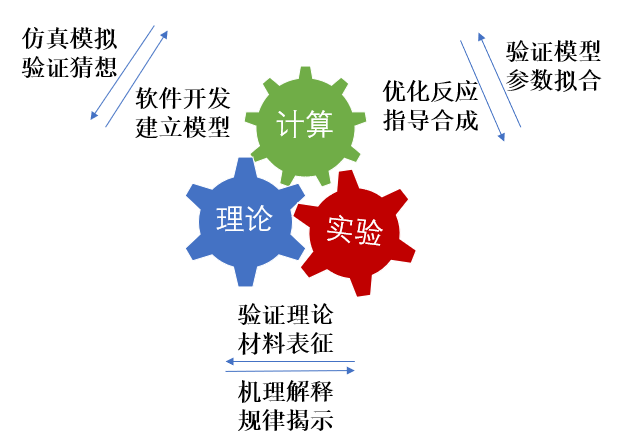

计算化学
=================================

  随着量子化学理论的不断完善，计算化学已经成了化学工作者解释实验现象、预测实验结果、指导实验设计的重要工具，在药物的合成、催化剂的制备等方面有着广泛的应用。但是，面对计算化学所涉及的巨大计算量，经典计算机在计算精度、计算尺寸等方面显得能力有限，这就在一定程度上限制了计算化学的发展。而费曼曾提出：可以创造一个与已知物理系统条件相同的系统，让它以相同的规律演化，进而获得我们自己想要的信息。费曼的这一猜想提示我们——既然化学所研究的体系是量子体系，我们何不在量子计算机上对其进行模拟呢？

  就目前的有噪声的中等规模量子(NISQ)计算机而言，可以通过变分量子特征值求解算法(Variational Quantum Eigensolver，简称VQE)，在量子计算机上实现化学模拟。该算法作为用于寻找一个较大矩阵的特征值的量子与经典混合算法，不仅能保证量子态的相干性，其计算结果还能达到化学精度。

  计算化学，顾名思义，就是利用数学方法通过计算机程序对化学体系进行模拟计算，以解释或解决化学问题。早期由于计算能力较弱，化学研究主要以理论和实验交互为主。但随着科学技术的蓬勃发展、量子化学理论的不断完善，计算已经成为一种独立的科研手段，与理论和实验相为验证，密不可分。如今，计算化学对于化学工作者来说，已经成了解释实验现象、预测实验结果、指导实验设计的重要工具，在材料科学、纳米科学、生命科学等领域得到了广泛的应用。

.. centered:: 图 1: 计算、理论与实验的相互关系

  计算化学主要包括两个分支——量子化学与分子模拟，其理论基础分别源自量子力学(Quantum Mechanics, QM)与分子力学(Molecular Mechanics, MM)。

  理论量子化学主要是使用量子力学(QM)来计算分子系统中电子的状态和性质。通俗意义上讲就是通过求解薛定谔方程来得到分子系统中电子的运动状态，而这些运动状态决定了其分子的化学性质。它们决定了一个化学反应是否能发生。精确求解电子Hamiltonian需要巨大的算力，对于小分子求解尚可进行，但是无法计算大分子。这时就需要基于经验参数的分子力场(Molecular Field)方法。

  在分子力场或分子力学(MM)方法中，分子被视为机械连接的原子系统。与量子力学方法不同的是，电子的具体分布没有被精确地计算，而是与原子核一起作为有效的原子(effective atoms)。由于分子力场的方法中，每个键的类型和参数都是在计算前根据体系被选定好的，它可以在典型的键合距离(bonding distance)下很好地描述大型的分子系统。但不可能描述发生键断裂和形成的反应或转化。换句话说，分子力场可以模拟大分子系统，但是无法精确求解其具体电子的分布，而这正是化学反应的关键所在。

  这里我们主要聚焦量子化学方法。化学行为的本质是分子中电子运动的结果，而电子的运动遵循量子力学，所以量子化学是一个量子计算天然的用武之地。传统的量子化学主要使用经典计算机来计算模拟量子体系，但量子系统的波函数的复杂度随粒子数呈指数增长。这种指数级的增长使得经典计算机在处理类似问题时很棘手，比如当前人们对多体物理和强关联系统等问题还无法进行精确求解。基于量子力学原理的量子计算机给计算化学开辟了新的方向，由于量子比特的量子性质，可以实现叠加和纠缠，因此可以有效地存储量子系统的波函数。同时我们需要在计算化学中运用量子算法来加快运算效率，从而研究用经典算法有限甚至不可能计算的系统。