VQE流程简介
=================================

3.1 变分原理
----------------------------------
  对于一个 :math:`n` 阶的方阵，如果想找到它的特征值 :math:`\lambda_0,\lambda_1,\lambda_2,\ldots,\lambda_n` ，可以利用VQE算法。在量子化学中，该算法被用于寻找描述某一体系(如多电子体系)哈密顿量的特征值 :math:`E_0,E_1,E_2,\ldots,E_n` ，根据变分原理(Variational Principle)，其可求得的最小特征值即为体系的基态能量 :math:`E_0` 。这里的变分原理起源于数学领域的泛函分析，最初见于著名的例子最速曲线问题 [1]_，随后被物理和化学学者应用到各自领域中，意在解决无法直接解析的极值函数问题。变分原理的基础是Euler-Lagrangian方程，它对应着泛函的临界点。在量子化学中常用于解电子薛定谔方程以得到目标能量。变分法求解基态能量可表述如下 [2]_：

  设量子体系的哈密顿量为 :math:`\hat{H}` ， :math:`|\psi\rangle` 态为空间中任意未知的态矢量(称为试验态矢量),并且 :math:`|\psi\rangle` 满足归一化条件 :math:`\langle \psi|\psi \rangle =1`。我们将 :math:`\hat{H}` 在态 :math:`|\psi\rangle` 中的平均值 :math:`\langle \hat{H} \rangle` 看作态矢量 :math:`|\psi\rangle` 的泛函。

.. math::
   \langle \hat{H} \rangle=\dfrac{\langle \psi |\hat{H}| \psi \rangle}{\langle \psi|\psi \rangle}     (1)

考虑一个任意的物理体系，其哈密顿量 :math:`\hat{H}` 与时间无关。设体系包括 :math:`\hat{H}` 在内的一组力学量完全集的共同本征态为 :math:`\{ |\psi_i \rangle \}` ，相对应的能量本征值为 :math:`E_0 \leq E_1 \leq E_2 \leq \ldots` ,展开试验态矢量 :math:`|\psi \rangle = \Sigma_i a_i |\psi_i \rangle` 。于是

.. math::
   \langle \psi |\hat{H}| \psi \rangle= \sum_{i=0}^{\infty} |a_i|^2 E_i     (2)

且有 :math:`\langle \psi|\psi \rangle = \sum_{i=0}^{\infty} |a_i|^2 = 1` 。 对于 :math:`i\geq 0` ，有 :math:`E_i \geq E_0` 且满足 :math:`|a_i|^2 E_i \geq |a_i|^2 E_0` ，因此

.. math::
   \langle \hat{H} \rangle=\dfrac{\langle \psi |\hat{H}| \psi \rangle}{\langle \psi|\psi \rangle} = \dfrac{\sum_i {|a_i|}^2 E_i}{\sum_i |a_i|^2} \geq \dfrac{\sum_i {|a_i|}^2 E_0}{\sum_i |a_i|^2}=E_0      (3)

上式说明，用变分原理求出的能量极值 :math:`\langle \hat{H} \rangle` 总是大于或等于体系的准基态能量(exact ground state energy)，它给出了体系基态能量的一个上界(upper bound)。

  从式(3)中可以看出，如果所选择的试验态 :math:`|\psi\rangle` 正好就是体系的基态 :math:`|\psi_0\rangle` , 那么不等式中的等号成立，我们直接得到了体系的基态能量 :math:`E_0` ；但往往更多的情况是，选择的试验态 :math:`|\psi\rangle` 与体系的基态相比有一定差距，导致计算得到的 :math:`E` 大于 :math:`E_0` 很多，这时就需要引入一组参数 :math:`\vec{\theta}` ，通过不断迭代参数来调节试验态波函数 :math:`|\psi(\vec{\theta})\rangle` ，使其最终非常接近体系的基态。通过上述过程求解系统基态能量的方法称为变分法，也是VQE之所以是Variational的原因。

.. math::
   \langle \hat{H} \rangle=E(\vec{\theta})=\dfrac{\langle \psi(\vec{\theta}) |\hat{H}| \psi(\vec{\theta}) \rangle}{\langle \psi(\vec{\theta})|\psi(\vec{\theta}) \rangle} \geq E_0     (4)

3.2 VQE流程概述
----------------------------------
  变分量子特征值求解算法(Variational Quantum Eigensolver, VQE) 是一种经典-量子混合算法，它使用参数化的量子线路来构造波函数，利用经典计算机来优化这些参数，使哈密顿量的期望值最小化，得到的最小能量即所求的基态能量。它的基本流程如图1所示，具体流程包括量子态制备、哈密顿量子项 :math:`H_i` 的测量、求和、收敛性判断和参数优化等过程，其中，量子态制备(quantum state preparation)、哈密顿量子项的测量(也称量子期望估计 quantum expectation estimation)是在量子计算机上进行的，即图中淡黄色部分，其它的步骤如求和、参数优化由经典计算机完成，即图中淡蓝色的部分。

  具体来讲， VQE 算法流程可以总结为以下步骤： 

(i) 选一组随机初始参数 :math:`\theta_1^k, \theta_2^k, \theta_3^k \ldots \theta_n^k` 
(ii) 在虚拟机或量子计算机上制备试验波函数 :math:`|\psi(\vec{\theta})\rangle` 
(iii) 对哈密顿量的各个子项进行测量，然后在经典计算机上进行求和，得 :math:`|\psi(\vec{\theta})\rangle` 的哈密顿量的期望值，即分子的能量
(iv) 判断该能量是否满足收敛条件，如果满足，则将该能量作为分子基态能量的近似值，终止计算；如果不满足，则变分优化参数，利用经典优化器产生一组新的参数 :math:`\theta_1^{k+1}, \theta_2^{k+1}, \theta_3^{k+1} \ldots \theta_n^{k+1}` ，重新制备量子态
(v) 重复2-4步，直到能量收敛。

此时，理论上参数化量子线路已制备好哈密顿量的基态，或非常接近基态的状态。与量子相位估计算法相比， VQE需要更少的门数和更短的相干时间。它以多项式的重复次数换取所需的相干时间的减少。因此，它更适合于 NISQ 时代。

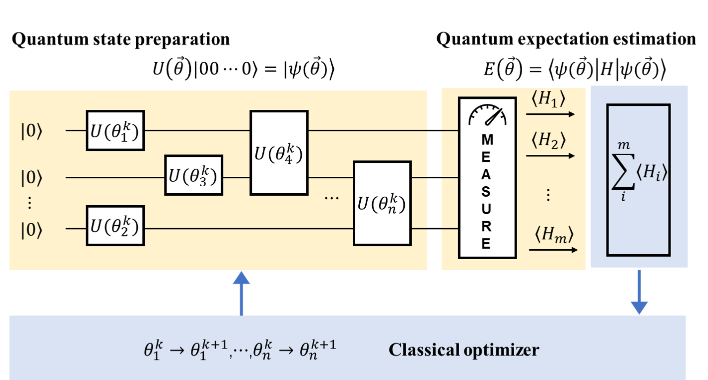
.. centered:: 图 1: 经典-量子混合的VQE算法流程(图改自 [3]_)

  图2展示的是VQE流程中量子线路的部分，即图1淡黄色的部分。量子态的制备部分我们以UCC拟设为例来进行线路构造。使用UCC拟设来制备试验态通常是先在线路上搭建好参照态 :math:`|\psi_{ref}\rangle` ，然后添加上节中式(23)的 :math:`\hat{U}(\theta)` 酉耦合簇算符演化生成试验波函数 :math:`|\psi(\theta)\rangle` 。

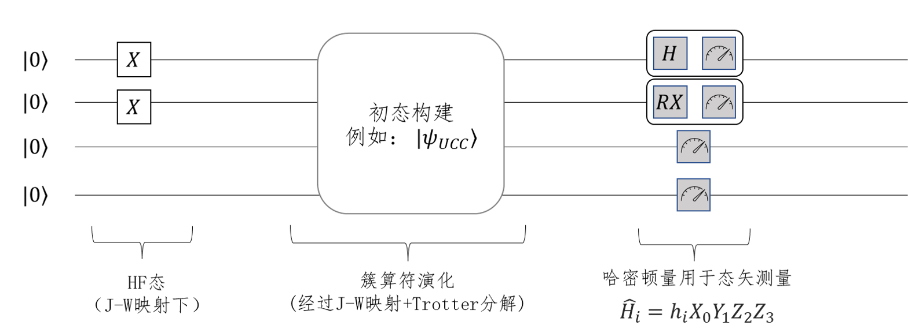
.. centered:: 图 2: VQE量子线路部分的流程

3.3 量子线路初态的构造
----------------------------------
  我们来看一下线路初态的具体构造。实际的演化线路中，开始每个比特的状态都默认为 :math:`|0\rangle` 态，若要构造 :math:`|1\rangle` 态的比特，我们首先需要对它翻转。回顾基础量子门的作用，Pauli-X门正好可以实现这个操作，所以只需对 :math:`|0\rangle` 态的对应比特施加X门即可，如式(5)所示。因此，JW映射下四个自旋轨道的氢分子体系的Hartree- Fock初态如图3所示，对第0、1比特施加X门就将 :math:`|0000\rangle` 的量子状态变成了所需的 :math:`|0011\rangle` 态。

.. math::
   \label{eq:Initial_state} X |0\rangle = \begin{bmatrix}0 & 1\\ 1 &  0 \end{bmatrix} \begin{bmatrix} 1\\ 0 \end{bmatrix} = \begin{bmatrix} 0\\ 1 \end{bmatrix} = |1\rangle     (5)

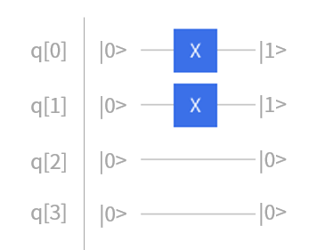
.. centered:: 图 3: JW映射下四个自旋轨道的氢分子初态构建

  事实上，对于任意一个含有 :math:`M` 个自旋分子轨道的 :math:`N` 电子体系，它的 Hartree-Fock 态都可以这样简单的表示。只要在量子线路中给定 :math:`M` 个量子比特，然后在前 :math:`N` 个量子线路上加上Pauli-X门即可得到所需要的$N$电子体系的 Hartree-Fock态。  

.. math::
   |\psi_{HF}\rangle = |\underbrace{0 \ldots 0\overbrace{11\ldots11}^{\mbox{N个电子}}}_{\mbox{M个量子比特}}\rangle

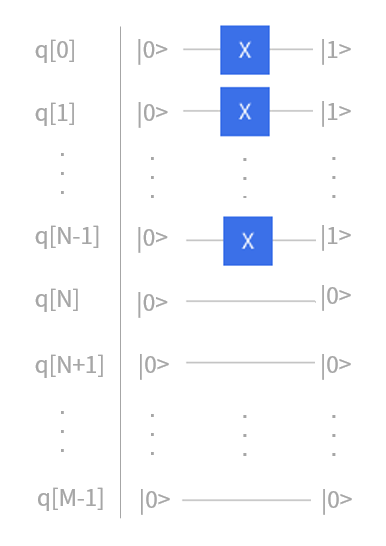
.. centered:: 图 4: JW映射下 `M` 个自旋轨道的 `N` 电子体系初态构建

3.4 拟设线路的构造
----------------------------------
  在理论基础章节讲完映射和拟设之后，原则上，只要我们给定费米子形式的簇算符，就可以将其转化成Pauli算符串，然后加载进量子线路上进行拟设线路的构造。接下来，我们看看如何根据这些Pauli算符串来得到最终的量子线路，然后进行演化。首先，考虑两个Pauli Z门的指数情况，在线路的情况如图5所示，这里的第一个CNOT门是用来纠缠两个量子比特，然后应用Rz门，再然后是第二个CNOT门。通过使用附加的CNOT门，这种线路结构可以推广到更多的量子比特。比如对于三个Pauli Z门的张量积情况，其线路如图6所示。所以可以看出，对于更多量子比特的情况，其线路结构也是很容易拓展得到的。

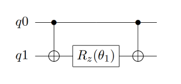
.. centered:: 图 5: 两个Pauli Z门的量子线路

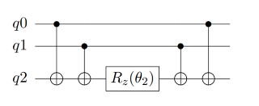
.. centered:: 图 6: 三个Pauli Z门的量子线路

  刚才，我们考虑的都是只有Pauli-Z门的。实际线路中，还存在许多含有其它Pauli算符的情况，这时我们就需要对X、Y基进行转换，转到Z基上再通过上述的线路实现。比如，对Pauli-X矩阵而言，可以通过在前后加一个H门来完成基的变换；而对于Pauli-Y门，则通过在前后加两个旋转X门来完成，如式(6)所示。因此，对于指数上含有Pauli-X门和Pauli-Z门的直积的情况，如 :math:`e^{-i \theta_3 (\sigma_x^0 \otimes \sigma_z^1)}` ，只需在Pauli-X门所作用的比特前后分别加H门就可以实现模拟，具体的量子线路如图7所示。类似的，当指数上有Pauli-Y门的时候，如 :math:`e^{-i \theta_4 (\sigma_z^0 \otimes \sigma_y^1)}` ，需要在其作用的量子比特前后各加一个旋转X门。具体的量子线路如图8所示。

.. math::
    \sigma_x &= H \sigma_z H \\
	\sigma_y &= {\rm RX}(-\dfrac{\pi}{2}) \sigma_z {\rm RX}(\dfrac{\pi}{2})     (6)

其中，

.. math::
   &{\rm RZ}(\theta)=e^{-i\theta Z/2}= \begin{bmatrix} e^{-i\theta/2} & 0\\ 0 & e^{i\theta/2} \end{bmatrix} \\
	H = \dfrac{1}{\sqrt{2}}&\begin{bmatrix} 1 & 1 \\ 1 & -1 \end{bmatrix} ; 
	{\rm RX}(\theta)= \begin{bmatrix} \cos(\dfrac{\theta}{2}) & -i\sin(\dfrac{\theta}{2}) \\ -i\sin(\dfrac{\theta}{2}) & \cos(\dfrac{\theta}{2}) \end{bmatrix}     

  如果对于一些更加复杂的Pauli算符串，同时含有多个Pauli-X、Pauli-Y门时，利用这些规律进行扩展即可相应模拟线路。例如对于这个有4个Pauli算符串 :math:`e^{-i \theta_5 (\sigma_x^0 \otimes \sigma_z^1 \otimes \sigma_y^2 \otimes \sigma_x^3)}` ，其中包含了2个Pauli-X门、一个Pauli-Y门、一个Pauli-Z门，转换后得到它的量子线路如图9所示。

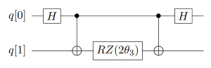
.. centered:: 图 7: 指数上含Pauli-X门的量子线路

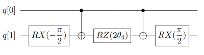
.. centered:: 图 8: 指数上含Pauli-Y门的量子线路

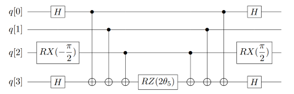
.. centered:: 图 9: 指数上更复杂的Pauli算符串的量子线路

  通过对上述过程进行推广，我们由此可以模拟复杂的酉正簇算符，让其在线路上对初态进行演化，从而制备出最接近真实基态的试验态波函数。下面我们就来看一下如何在量子线路上构造上一节例2的单激发簇算符。在上一节的例3中我们已经通过JW变换将簇算符从费米子形式转换成泡利直积的形式，即：

.. math::
   a_3^{\dagger} &= \frac{1}{2}X_3 \otimes Z_2 \otimes Z_1 \otimes Z_0-\frac{i}{2}Y_3 \otimes Z_2 \otimes Z_1 \otimes Z_0 \\
	a_1 &= \frac{1}{2}I_3 \otimes I_2 \otimes X_1 \otimes Z_0 + \frac{i}{2}I_3 \otimes I_2 \otimes Y_1 \otimes Z_0     

根据泡利算符的性质，则该单激发簇算符 :math:`a_3^{\dagger} a_1` 为四项：

.. math::
   \dfrac{i}{4} Y_1 \otimes Z_2 \otimes X_3 +\dfrac{1}{4} X_1 \otimes Z_2 \otimes X_3 +\dfrac{1}{4} Y_1 \otimes Z_2 \otimes Y_3 -\dfrac{i}{4} X_1 \otimes Z_2 \otimes Y_3     

如我们在2.4节中所讲的，只有是厄米矩阵才可以放在指数上进行线路演化，我们需要构造出酉算子版本的指数耦合簇算符，如上一节式(23)所示。这里 :math:`a_3^{\dagger} a_1` 要减去其共轭转置 :math:`a_1^{\dagger} a_3` ，即：

.. math::
   -\dfrac{i}{4} Y_1 \otimes Z_2 \otimes X_3 +\dfrac{1}{4} X_1 \otimes Z_2 \otimes X_3 +\dfrac{1}{4} Y_1 \otimes Z_2 \otimes Y_3 +\dfrac{i}{4} X_1 \otimes Z_2 \otimes Y_3     

故最后留下两项，即

.. math::
   \dfrac{i}{2} (Y_1 \otimes Z_2 \otimes X_3 -X_1 \otimes Z_2 \otimes Y_3)     

根据上述构造线路的方法，我们在量子线路上构造下式，其量子线路如图10所示。

.. math::
   e^{\theta_{13}(a_3^{\dagger}a_1-a_1^{\dagger}a_3)}=e^{(i \theta_a/2) \sigma_y^1 \otimes \sigma_z^2 \otimes \sigma_x^3}e^{(-i \theta_b/2) \sigma_x^1 \otimes \sigma_z^2 \otimes \sigma_y^3}     

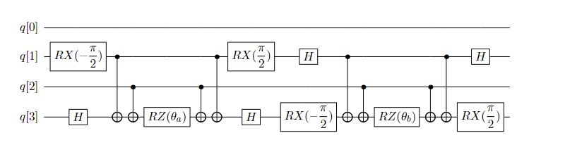
.. centered:: 图 10: 单激发算符 :math:`a_3^{\dagger} a_1-a_1^{\dagger} a_3` 的量子线路

  我们接着来看UCCSD整体拟设线路的构造。对四个自旋轨道的氢分子，不考虑自旋禁阻与自旋对称，它最终参数化的费米簇算符有五项，如上一节式(22)所示，分别列于图11线路上五个模块中。图10的线路即是图11中第二个模块的线路实现，描述的是位于轨道1的电子到轨道3上的激发。通过这五个模块的线路演化就获得了试验态。

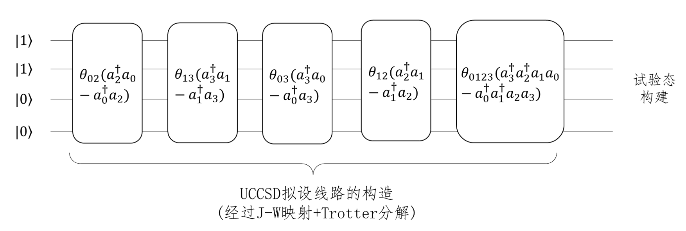
.. centered:: 图 11: JW映射下氢分子UCCSD拟设线路的构造

  图10展示的仅仅是一项单激发簇算符拟设线路的构造，双激发簇算符转换成泡利形式一共有16项，而且对于更大的基组，更多的电子数，单、双激发算符会更多，自然线路深度和待优化的参数量就会随之增长，正如我们在2.4一节最后提到的那样，针对拟设线路进行适当的截断或者优化对于模拟更大化学的化学体系具有重要的意义。

3.5 量子期望估计
----------------------------------
  拟设线路构造完成，制备好了试验态，我们就可以测量哈密顿量的期望，此过程又叫做量子期望估计。VQE中，哈密顿量作为可观测量用于测量过程。需要注意的是，经过映射后，尽管簇算符和哈密顿算符都会以泡利形式书写，但是哈密顿算符不需要经过指数化操作放在线路上演化，而是直接作用在最后的测量中，所以线路实现和前面所讲有些许不同。比如，对于一个哈密顿量 :math:`\hat{H}_i=h_i X_0 Y_1 Z_2 Z_3` ，它的测量线路如图12所示，其中类似秒表一样的符号是测量门操作。可以看到，第2，3比特上只有Z门，可以直接测量返还该态在计算基上的期望。但是第0，1号比特上存在X，Y门，这时需要分别使用H门和 :math:`RX(-\pi /2)` 门旋转换基到到Z方向再测得。

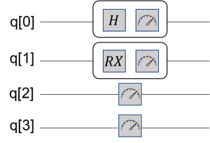
.. centered:: 图 12: 哈密顿量用于态矢测量

接着我们来看测量值的读取。与QPE中使用二进制编码来存储相位信息不同，在VQE中，测量的结果是0、1构成的量子态，态的每一位比特存储的是自旋信息，这是由于“测量”代表使用Pauli-Z作用在末态上，此时量子位坍缩为 :math:`|0\rangle` 或 :math:`|1\rangle` 态。态 :math:`|1\rangle` 对应Pauli-Z中密度矩阵 :math:`|1\rangle\langle1|` 的系数是-1，态 :math:`|0\rangle` 对应密度矩阵 :math:`|0\rangle\langle0|` 的系数是1，所以，单次测量返还的结果如式(7)所示。真实结果通常要求反复多次测量，取若干次测量进行加权得到期望。假设进行m次测量，得到-1的次数为k，那么最终的期望 :math:`E_i` 可以按式(8)计算得到。

.. math::
   |j_1 j_2 \ldots j_n\rangle = (-1)^{\mbox{number of 1 in n}}     (7)

.. math::
   E_i = \langle H_i \rangle = h_i * \dfrac{-1*k + (m-k)}{m}     (8)

**例** 假设一哈密顿量 :math:`\hat{H}=h_0 XY + h_1 ZZ` ，其中系数 :math:`h_0, h_1` 为单、双电子积分常数，由经典计算积分而来，为上节中式(14)中的 :math:`h_{pq}` 与 :math:`h_{pqrs}` ，表示每个子项的能量贡献值。在量子线路上，测量1000次的结果如下表所示。可以看到 :math:`h_0` 在 :math:`|00\rangle` ， :math:`|01\rangle` ， :math:`|10\rangle` ， :math:`|11\rangle` 四态出现的次数分别为200，200，100，500， :math:`h_1` 出现的次数分别为0，500，500，0。所以，根据式(8)计算，最终结果为 :math:`0.4h_0 - h_1` 。

.. image:: ./picture/table.png
   :align: center
.. centered:: 图 13: 某哈密顿量测量1000次的结果

3.6 经典优化器参数优化
----------------------------------
  在3.1节中我们构造了含参的拟设线路，进行量子期望估计后，需要不断迭代优化Ansatze中涉及的参数以获取最低的能量，并以此能量最低的叠加态作为当前分子模型的基态。VQE中对这些参数的优化是利用经典优化器来处理的，截止目前，pyChemiQ提供了以下几种优化器：NELDER-MEAD、POWELL、COBYLA、L-BFGS-B、SLSQP和Gradient-Descent。其中无导数优化方法为Nelder-Mead, Powell, COBYLA; 一阶方法为L-BFGS-B、SLSQP和Gradient-Descent。

**NELDER-MEAD算法**

  NELDER-Mead方法是无导数优化方法，它可以用来解决求给定非线性方程最小值的经典无约束优化问题。对于具有n个参数的函数，该算法保留一个 :math:`n+1` 个点的集合，而这些点就是 :math:`n` 维空间中多面体的顶点。这个方法通常被称为“单纯形算法”。

**POWELL算法**

  POWELL又称方向加速法，它由POWELL于1964年提出，是利用共轭方向可以加快收敛速度的性质形成的一种搜索方法。该方法不需要对目标函数进行求导，当目标函数的导数不连续的时候也能应用，因此POWELL算法是一种十分有效的直接搜索法。POWELL算法可用于求解一般无约束优化问题，对于维数 :math:`n<20` 的目标函数求优化问题，此法可获得较满意的结果。不同于其他的直接法，POWELL法有一套完整的理论体系，故其计算效率高于其他直接法。该方法使用一维搜索，而不是跳跃的探测步。同时，POWELL法的搜索方向不一定为下降方向。

**COBYLA算法**

  线性近似的约束优化算法，简称COBYLA算法。该算法是一个顺序信赖域法。根据单纯形方法，问题的约束条件被转换为包含解的闭包单纯形。根据目前迭代最优解一定出现在闭包顶点上的理论，不断运用信赖域方法来优化和缩小可行性区域的闭包，最终求得满足精度要求的闭包和相应解。COBYLA算法是一个不需求导支持和线性约束的优化算法。

**L-BFGS-B算法**

  Limited-memory-BFGS-Bounded算法，简称L-BFGS-B算法，是一种拟牛顿算法。根据梯度方法的思路，可以得到牛顿法（二阶梯度法），然后使用正定矩阵来近似二阶导数矩阵以减少得到拟牛顿法所需的计算次数。通过继续简化正定矩阵的构建过程，构建近似矩阵的复杂度也得到降低，最终通过适应边界条件以获取该算法。L-BFGS-B算法是一个需要求导的有界无约束优化算法。

**SLSQP算法**

  Sequential Least SQuares Programming optimization，简称SLSQP算法。该算法是一个依赖KKT条件的顺序最小二乘规划算法。从本质上来讲，它是一个用来求解二次规划问题的顺序(或逐步)的拟牛顿法。SLSQP算法是一个需要使用求导方法的有界约束优化算法。它将一般的优化问题转化为二次规划问题。

**GRADIENT-DESCENT算法**

  梯度下降(gradient descent)是一种常见的一阶(first-order)优化方法，是求解无约束优化问题最简单、最经典的方法之一。梯度下降法的优化思想是用当前位置负梯度方向作为搜索方向，因为该方向为当前位置的最快下降方向，所以也被称为是“最速下降法”。最速下降法越接近目标值，步长越小，前进越慢。

**参考文献**

.. [1] Herman Erlichson. Johann bernoulli’s brachistochrone solution using fermat’s principle of least time. `European journal of physics` , 20(5):299, 1999.
.. [2] Ira N. Levine. `Quantum chemistry` . Pearson Prentice Hall, Upper Saddle River, NJ, 5th edition, 2000.
.. [3] Qingchun Wang, Huan-Yu Liu, Qing-Song Li, Ye Li, Yahui Chai, Qiankun Gong, Haotian Wang, Yu-Chun Wu, Yong-Jian Han, Guang-Can Guo, et al. Chemiq: A chemistry simulator for quantum computer. `arXiv preprint arXiv:2106.10162` , 2021.
